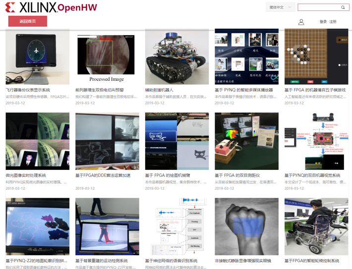

# PYNQ-提高ZYNQ器件生产力

<i></i>

# Python已经成为全世界使用最广泛的编程语言

<i></i>

# PYNQ-为Xilinx平台引入更多的软件开发者

<i></i>

# 从Jupyter Notebook到Jupyter Lab

<i></i>

# Jupyter Lab运行在ZYNQ-PS侧 （内部的Cortex-A9或者A53 ARM硬核）

<i></i>

# PYNQ系统架构

<i></i>

# PYNQ-基于Ubuntu系统

<i></i>

# Ubuntu系统-更好的软件生态

<i></i>

# 并非都要成为FPGA设计专家

<i></i>

# 丰富的Overlay可供下载

<i></i>

# PYNQ框架已经为PS和PL的接口提供Linux驱动，并封装为Python库

<i></i>

# Python库-以MMIO为例

<i></i>

# 统一的接口赋予PYNQ框架高效率

<i></i>

# 简单的安装方式

<i></i>

# 加载Overlay到Zynq器件

<i></i>

# 赋予硬件开发者全新的验证方式

<i></i>

<i></i>

# Python赋予我们更多的想象

<i></i>

<i></i>

# Numpy数据如何传输到FPGA

<i></i>

# Numpy数据分析的有效工具

<i></i>

# 云-端协同

<i></i>

<i></i>

# 学生竞赛

<i></i>

# 移植到其它平台

<i></i>

什么是PYNQ？**

PYNQ是Python On Zynq的缩写，它是一个软件开发框架，指导硬件层、驱动层和应用层之间的接口设计，不是ISE、Vivado、SDSoC这样的IDE工具，更不是Zynq芯片的下一代芯片产品。

<i></i>

PYNQ框架的设计初衷是通过高层次的封装，将底层硬件FPGA实现细节与上层应用层的使用脱耦，让上层应用开发者通过Python编程就可以调用FPGA模块，不需要懂Verilog/VHDL硬件编程就可以享受FPGA可并行计算、接口可方便扩展和可灵活配置带来的诸多好处。

在ARM A9 CPU上运行的软件包括：

·         载有Jupyter Notebooks设计环境的网络服务器

·         IPython内核和程序包

·         Linux

·         FPGA的基本硬件库和API

 

**如何在PYNQ上开发？**

请参见网页[www.pynq.io](file:///C:/Users/mqiao/Desktop/PYNQ-Z1%20Python%20Productivity%20for%20Zynq/www.pynq.io)。

​                
 也欢迎您加入PYNQ微信公众号，在这里，您将找到可以帮助您开始使用PYNQ的参考资料和应用案例。

<i></i>

**PYNQ-Z2****是否支持传统开发方式？**

除了支持PYNQ框架，PYNQ-Z2也可以采用传统的ZYNQ开发方式，使用Vivado, SDK, SDSoC等工具进行开发。