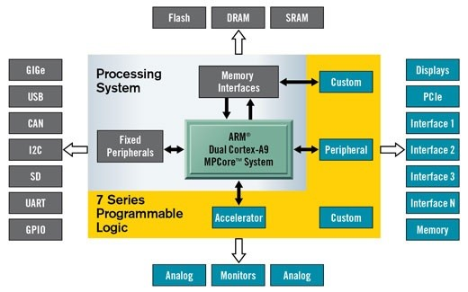
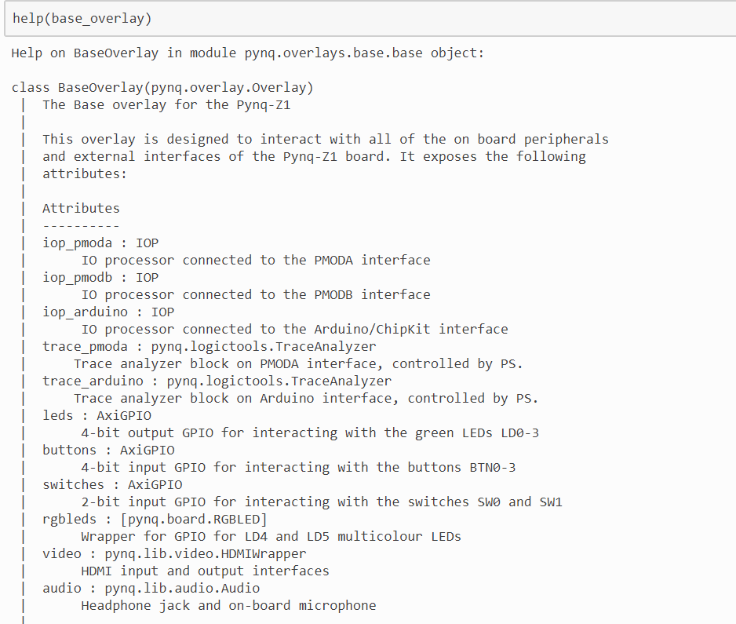

# OVERLAY介绍

Overlays，或者硬件库，都是可编程FPGA的设计理念。通过它们，用户可以把Zynq处理系统（Processing System of the Zynq）上的应用扩展到可编程逻辑层面上。Overlays可以用来加速软件应用或者为特定的应用自定义其硬件平台。

<i></i>

举例来说，FPGA可提供加速的一个经典案例便是图像处理。而一个软件工程师可以在FPGA结构上使用一个overlay进行相似的图像处理操作（比如边缘检测）。Overlays可以依据需求动态的加载到FPGA上，就像调用软件库一样。在这个例子里，不同overlay上的图像处理函数可以根据Python的指令分别进行加载调用。

PYNQ提供了一个Python交互界面，允许我们通过处理系统上的Python来控制可编程逻辑里的overlays。FPGA设计是一个非常专业化的任务，这需要专业的硬件工程知识。PYNQ的overlays就是由硬件设计师创建，并且包装成了PYNQ PYTHON API。软件开发者就可以无需重新自己设计overlay，而是直接使用这些写好的overlay来操作特定的硬件模块。这其实和专业软件工程师设计软件库并把它们包装成用户可用的API的道理一样。

# 加载Overlay

一般来讲，我们把那些比较基层的、更像是用来做参考设计的overlay称为base overlay。它们是已经烧写在SD卡上的。当然了，我们也可以自己安装新的Overlay并在运行中使用他们。每一个Overlay都会有其对应的.bit文件，比如base_overlay对应的就是base.bit。我们可以用下图的方法加载Overlay。

<i></i>

对于我们提到的已有的base overlay，PYNQ很贴心的为我们准备了专门的类，方便我们使用它们。之后，我们将通过学习base overlay来熟悉板的使用。调用代码如下图所示：

<i></i>

base_overlay就是把bit文件转化后的python类。对于一个python类，我们自然可以使用前面介绍的辅助函数help来查看这个类到底是个什么东西，通过输入help(base_overlay)，我们可以查看这个类的具体介绍。下面只是一部分：

<i></i>

