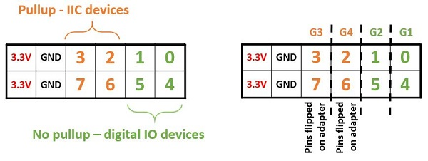
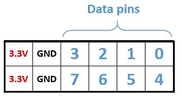
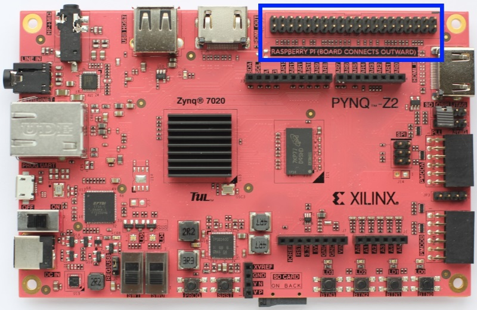

# 前言

Zynq平台通常有多个Headers和接口，它们用来连接外部设备或者直接连接Zynq PL引脚。许多现成的外部设备都可以连接到Pmod和Arduino接口上。其他的外部设备可以通过**转换器**（Adapter）或者**面包板**（Breadboard）连接到这些端口。需要注意的是当我们要使用一个外部设备的时候，我们必须先在overlay中构建一个控制器，并提供相应的软件驱动，然后我们才能使用这个设备。

接下来，我们按照如下目录逐一介绍：

- Arduino
- Grove
- Pmod
- RPi

------


# **Arduino**

Arduino子包包含了所有用来控制连接到Arduino端口的外部设备的驱动装置。一个Arduino连接器可以把Arduino compatible shields连接到PL引脚上。不过要记得在一个overlay里必须有相应的控制器来执行对应的驱动，这之后shield才能被使用。Arduino引脚也可以用作通用引脚来连接传统的硬件设施。

<p align="center">

</p>
<p align = "center">
<i></i>
</p>

如果有的话，一个Arduino PYNQ MicroBlaze可以控制Arduino接口。这个MicroBlaze就和Pmod的MicroBlaze一样，只是有更多的AXI控制器。

<p align="center">

</p>
<p align = "center">
<i></i>
</p>

正如在图标里所示，Arduino PYNQ MicroBlaze有一个PYNQ MicroBlaze子系统，一个配置开关，以及以下AXI控制器：

- AXI I2C

  - Frequency: 100KHz

  -  Address mode: 7 bit

- 2x AXI SPI

  - Master mode

  - Transaction Width: 8

  - SCK Frequency: 6.25 MHz

  - FIFO Depth: 16

注意：一个SPI控制器是连接到专门的SPI引脚Arduino接口上的。

- 3x AXI GPIO
  - 16 Input/Output pins total

- 6x AXI Timer

  - 32 bits

  - 1 Generate Output

  - 1 PWM Output

- 1x AXI UART
  - 9600 Baud

- 1x AXI XADC
  - 1V peak-to-peak *

警告：模拟输入能通过内部的Xilinx XADC获得支持。这将支持1V peak-to-peak的输入。注意Arduino接口支持0-5V模拟输入，但没有外部电路的Zynq是不支持的。

- AXI Interrupt controller（AXI中断控制器）

  管控MicroBlaze子系统上的外部设备的中断操作。

- Interrupt GPIO（中断GPIO）

  有一个额外的AXI GPIO被用来标记发送到PS的中断请求。

- Configurable Switch（配置开关）

  允许从特定设备发送信号至外部接口。

<p align="center">

</p>
<p align = "center">
<i></i>
</p>
**实例：**

在Base Overlay里，有一个Arduino PYNQ MicroBlaze实例。在overlay被下载后，这个实例可按如下方式调用。

```javascript
from pynq.overlays.base import BaseOverlay
from pynq.lib.arduino import Arduino_LCD18
 
lcd = Arduino_LCD18(base.ARDUINO)
lcd.clear()
```

在pynq.lib.arduino包里可以找到更多有关Arduino的信息。


# **Grove**

Grove外部设备可以通过使用PYNQ Grove Adapter来连接到Pmod引脚上或者通过PYNQ Shield连接到Arduino引脚上。

- ### **Pmod**

连接Grove外部设备的第一个办法就是用Pmod PYNQ MicroBlaze。Grove设备可以依靠PYNQ Grove Adapter连接到Pmod端口。

<p align="center">

</p>
<p align = "center">
<i></i>
</p>

上面这个板上，G1和G2是映射到Pmod引脚[0,4]和[1,5]，也即连接到拥有**下拉电阻**（pull-down resistor）的引脚上。G1、G2端口支持SPI协议，GPIO，计时Grove设备，但是不支持IIC外部设备。G3、G4则映射到引脚[2,6]和[3,7]，也即连接到**上拉电阻**（pull-up resistor）的引脚，并支持IIC协议和GPIO外部设备。

<p align="center">

</p>
<p align = "center">
<i></i>
</p>


<p align="center">

</p>
<p align = "center">
<i></i>
</p>
- ### Arduino

  另一个连接Grove设备方法就是使用Arduino PYNQ MicroBlaze。

<p align="center">

</p>
<p align = "center">
<i></i>
</p>

<p align="center">

</p>
<p align = "center">
<i></i>
</p>

在PYNQ Shield上有四个IIC Grove 连接器（IIC又可标记为I2C），8个垂直的Grove连接器（G1-G7、UART）和4个水平Grove连接器（A1-A4）。SCL和SDA引脚是连接在Arduino header上的SCL和SDA引脚。

下面的表格标记了映射交互协议。

<p align="center">

</p>
<p align = "center">
<i></i>
</p>

**实例：**

在Base Overlay里，有两个可用实例：PMODA和PMODB。在一个overlay下载后，可如下创建Grove外设实例：

```javascript
from pynq.overlays.base import BaseOverlay
from pynq.lib.pmod import Grove_Buzzer
from pynq.lib.pmod import PMOD_GROVE_G1
 
base = BaseOverlay("base.bit")
 
grove_buzzer = Grove_Buzzer(base.PMODB,PMOD_GROVE_G1)
grove_buzzer.play_melody()
```

我们可以在pynq.lib.pmod找到更多例子。板上下面的地址里可以找到更多有关PYNQ Grove Adapter的例子

```javascript
<Jupyter Dashboard>/base/pmod/
```

Arduino接口的使用方法如下：

```javascript
from pynq.overlays.base import BaseOverlay
from pynq.lib.arduino import Grove_LEDbar
from pynq.lib.arduino import ARDUINO_GROVE_G4
 
base = BaseOverlay("base.bit")
 
ledbar = Grove_LEDbar(base.ARDUINO,ARDUINO_GROVE_G4)
ledbar.reset()
```

 

# **Pmod**

Pmod包是一个使用Pmod端的外部设备的驱动集合。一个Pmod端口是一个12引脚接口，很多来自Digilent和其他第三方合作生产商的Pmod设备都可使用。传统的Pmod外接设备包括了各式传感器（光、温度）、交互设备（网口、WIFI、蓝牙）以及输入输出设备（按钮、开关、LED）。

<p align="center">

</p>
<p align = "center">
<i></i>
</p>

每一个Pmod连接器是由2排6引脚共计12引脚构成的。每一排由3.3V(VCC),接地(GND)以及4个数据引脚构成。如果使用两排的话那就是8个数据引脚。

<p align="center">

</p>
<p align = "center">
<i></i>
</p>

Pmod使用双排引脚时（2x4引脚或者2x6引脚），应该从左边开始插入（以连上VCC和GND）

<p align="center">

</p>
<p align = "center">
<i></i>
</p>

而只使用一拍的Pmod设备可以使用任意一排，但还是要从左边开始插入。如果你要使用一个别人写好了的驱动或者overlay的话，你需要检查到底那一排是支持这个设备的，并不一定是两排都能成功。比如说，Pmod ALS目前就只支持上面一排的端口。

所有的引脚都在3.3V时正常工作。根据不同设备的不同上拉/下拉的I/O要求，Pmod数据引脚会有不同的IO标准。（例如IIC需要上拉，SPI需要下拉）

引脚0,1和4,5是连接到下拉电阻。这个可以支持SPI接口以及大部分外接设备。引脚2,3和6,7是连接到上拉电阻。这个可以支持IIC接口。

Pmod已经把这个上下拉的传统考虑进去了，所以在使用Pmod的时候无需额外担心。

<p align="center">

</p>
<p align = "center">
<i></i>
</p>

正如上面所示，每一个Pmod PYNQ MicroBlaze有一个MicroBlaze子系统，配置开关，和如下AXI控制器：

- AXI I2C
  - SCL Frequency 100 KHz
  - Address Mode: 7 bits
- AXI SPI
	- Master mode

	- Transaction Width: 8

	- SCK Frequency: 6.25 MHz

	- FIFO Depth: 16

- AXI GPIO
	- 8 Input/Output pins

- AXI Timer

	- 32 bits

	- 1 Generate Output

	- 1 PWM Output

- AXI Interrupt controller

	- 管理外设的中断。

- Interrupt GPIO

	- 有一个额外的AXI GPIO被用来标记发送到PS的中断请求。

- Configurable Switch

	- 允许从特定设备发送信号至外部接口。

**实例：**

```javascript
from pynq.overlays.base import BaseOverlay
from pynq.lib import Pmod_Timer
 
base = BaseOverlay("base.bit")
 
pt = Pmod_Timer(base.PMODA,0)
pt.stop()
```


# **RPi**

Rpi子包是控制连接RPi（Raspberry Pi）接口外设的驱动集合。同样的，在使用具体设备之前，我们需要加载相应的overlay上的控制器。RPi引脚也可用作通用引脚来连接传统的硬件设备。

<p align="center">

</p>
<p align = "center">
<i></i>
</p>

<p align="center">

</p>
<p align = "center">
<i></i>
</p>

如上图所示，RPi PYNQ MicroBlaze有一个PYNQ MicroBlaze子系统，一个配置开关和如下AXI控制器：

- 2x AXI I2C

	- Frequency: 100KHz

	- Address mode: 7 bit

- 2x AXI SPI

	- Master mode
	- Transaction Width: 8
	- SCK Frequency: 6.25 MHz
	- FIFO Depth: 16

注意：一个SPI控制器是连接到专门的SPI引脚Arduino接口上的。
- 1x AXI GPIO
  - 28 Input/Output pins total
- 2x AXI Timer
  - 32 bits
  - 1 Generate Output
  - 1 PWM Output
- 1x AXI UART
  - 115200 Baud
- AXI Interrupt controller
  - 管理外设的中断。
- Interrupt GPIO
  - 有一个额外的AXI GPIO被用来标记发送到PS的中断请求。
- Configurable Switch
  - 允许从特定设备发送信号至外部接口。


在pynq.lib.rpi包里可以找到更多信息。
