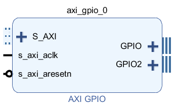
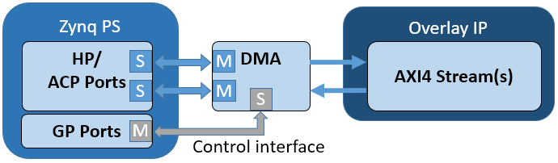
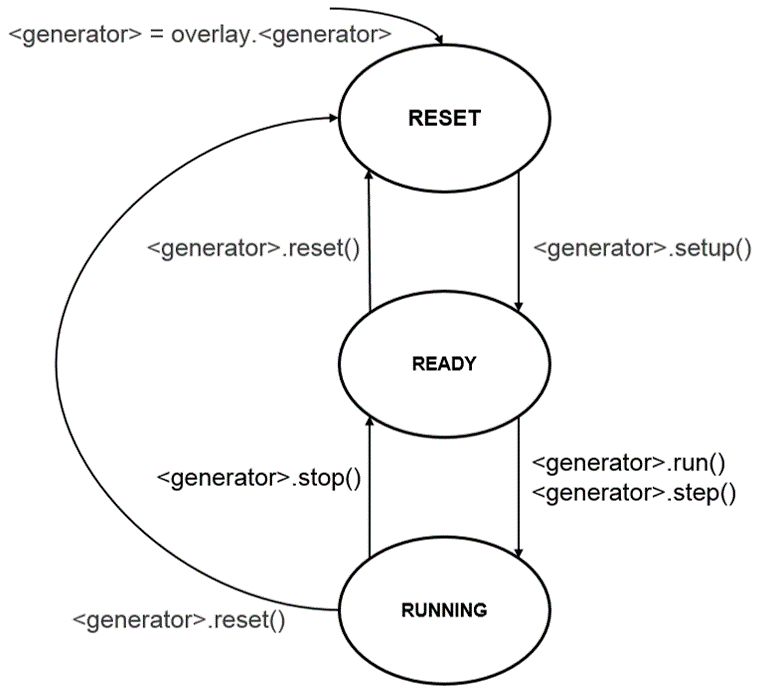
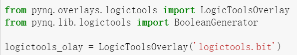
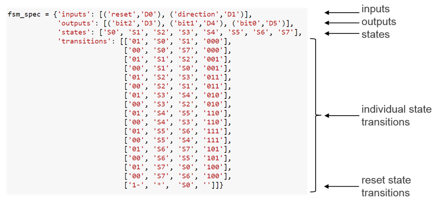
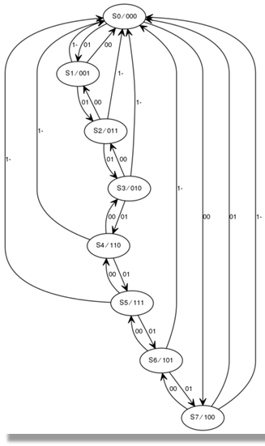
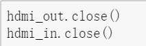
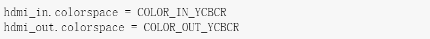
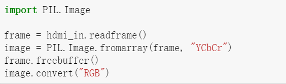

# 前言

Vivado工具为各种接口标准和协议的外设提供了IP，PYNQ给常用的外接设备- Video（HDMI IN/OUT）、 GPIO设备（Buttons, Switches, LEDs）、传感器和执行器等提供了Python API。这些PYNQ API也可以被扩展用以支持其他的IP。

本章节将按照如下顺序逐一介绍：

- Audio
- AxiGPIO
- AxiIIC
- DMA
- Logictools
- Video

------


# Audio（音频）

Audio模块提供了从输入麦克风读取音频、从播放器播放音频以及读写音频文件的方法。Audio模块是连接到Audio IP子系统上来捕获播放内容。该模块可以支持不同的IP子系统。目前支持的有line-in, PYNQ-Z2上使用ADAU1761编码的HP/Mic，PYNQ-Z1上的脉冲宽度调制器（Pulse Width Modulation）的单输出与脉冲强度调制器（Pulse Density Modulated）的麦克风输入。

**实例：**

Base Overlay有一个单独的Audio实例：audio。在overlay加载后，这个实例可以立即使用，如下所示：

**PYNQ-Z1**

> ```javascript
> from pynq.overlays.base import BaseOverlay
> base = BaseOverlay("base.bit")
> pAudio = base.audio
> 
> pAudio.load("/home/xilinx/pynq/lib/tests/pynq_welcome.pdm")
> pAudio.play()
> ```

**PYNQ-Z2**

```javascript
from pynq.overlays.base import BaseOverlay
base = BaseOverlay("base.bit")
pAudio = base.audio
pAudio.load("/home/xilinx/jupyter_notebooks/base/audio/data/recording_0.wav")
 
pAudio.play()

```

注：PYNQ-Z1支持直接的PDM播放，而PYNQ-Z2支持Wav）

我们可以在以下位置找到更多的例子。

```
<Jupyter Home>/base/audio/audio_playback.ipynb
```

 

# AxiGPIO

AxiGPIO类提供了读写通用设备如LED、按钮、开关等（需要通过AXI GPIO控制IP连接到PL上）并接受来自外部的中断。

每一个AXIGPIO能有至多两个通道，每一个通道至多有32个引脚。
<p align="center">

</p>
<p align = "center">
<i></i>
</p>
通过read()和write()方法，我们可以在一个通道上对任意的GPIO进行读写数据。

setdirection()和setlength()可以从来配置IP。方向可以是“in”、“out”、“inout”。

通常方向是“inout”。只选择“in”或者“out”将会分别只允许读与写IP，如果要读“out”或者写“in”将会报错。

GPIO可以像一个数组一样来处理。这允许我们设定特定的‘位’并避免使用**位屏蔽**（bit mask）的需求。

中断信号*ip2intc_irpt* 可以直接发送到AXI中断处理器上来引发PS的中断。我们可以在*PYNQ and Asyncio*部分中找到更多的有关异步IO和中断的信息。
<p align="center">

</p>
<p align = "center">
<i></i>
</p>
###  **实例：**

下面的例子只是展示了如何使用AxiGPIO类，实际使用的时候，可能会有LED, Button, Switches, 和RGBLED等扩展类可供使用。

在一个overlay加载了后，一个AxiGPIO实例可以立即通过AXI GPIO控制器的名字进行创建调用。

```javascript
from pynq import Overlay
from pynq.lib import AxiGPIO
ol = Overlay("base.bit")
 
led_ip = ol.ip_dict['gpio_leds']
switches_ip = ol.ip_dict['gpio_switches']
leds = AxiGPIO(led_ip).channel1
switches = AxiGPIO(switches_ip).channel1
```

简单的读写：

```javascript
mask = 0xffffffff
leds.write(0xf, mask)
switches.read()
```

把AXI GPIO当做数组处理：

```javascript
switches.setdirection("in")
switches.setlength(3)
switches.read()
```

我们可以在[pynq.lib.axigpio Module](https://pynq.readthedocs.io/en/latest/pynq_package/pynq.lib/pynq.lib.axigpio.html#pynq-lib-axigpio)部分中知道更多的有关读写等操作的例子。在下面的文件中，我们可以找到一些有关按钮与LED的例子。

<Jupyter Home>/base/board/board_btns_leds.ipynb

 

# AxiIIC

AxiIIC类提供了对AXI IIC控制器IP的读与写。send()和receive()方法可以用来读与写。

```javascript
send(address, data, length, option=0)
```

- Address是外部设备IIC的地址

- Data是一个被发送到IP的字节数组

- length是发送的字节数

- option允许一个IIC重复运行


```javascript
receive(address, data, length, option=0)
```

- Address是外部设备IIC的地址
- Data是一个被发送到IP的字节数组
- length是发送的字节数
- option允许一个IIC重复运行

更多有关AxiIIC模块和读写等操作可以在[pynq.lib.axiiic Module](https://pynq.readthedocs.io/en/latest/pynq_package/pynq.lib/pynq.lib.axiiic.html#pynq-lib-axiiic) 中找到。

 

## DMA（直接内存访问）

PYNQ支持AX central DMA IP。DMA可以在PS DRAM与PL的快速交互中发挥出色的效果。DMA类只支持简单模式。

DMA有一个AXI轻型控制接口，一个读写通道以及连接到一个IP的流端口。

<p align="center">

</p>
<p align = "center">
<i></i>
</p>

读通道会从PS DRAM中读取数据，并写入流中。写通道会从流中读取数据并写回PS DRAM里。

需要注意的是DMA在完成数据传输的时候，需要连接到DMA（写通道）的IP来设置AXI TLAST信号。若该信号未被设置，DMA将会永远无法完成该次传输。在使用HLS来产生IP的时候，这一点非常重要——TLAST信号必须在C代码中设置。

**实例：**

下面的例子假定overlay已经有一个AXI直接内存访问IP，一个来自DRAM的读通道，一个AXI Master流接口（用以操作输出流），一个写入DRAM的写通道，和一个AXI Slave流接口（用以操作输入流）。

在Python代码里，我们使用Xlnk创建了两个连续的内存缓冲。

DMA将会从input_buffer里读取数据，并发送至AXI Master。然后DMA再从AXI Slave将数据写回output_buffer。

AXI流之间是以本地环回接口的方式连接，以此在通过DMA发送和接收数据后，input_buffer的内容可以转移到output_buffer中。 

需要注意的是在制作DMA的实例的时候，默认最大的交互量是14bits。若需要更大的DMA交互，在配置DMA的时候增大这个量。

下面的代码中没有写出下载bitstream的代码。

```javascript
import pynq.lib.dma
from pynq import Xlnk
import numpy as np
 
xlnk = Xlnk()
 
dma = ol.axi_dma
 
input_buffer = xlnk.cma_array(shape=(5,), dtype=np.uint32)
output_buffer = xlnk.cma_array(shape=(5,), dtype=np.uint32)
```

写一些数据到数组里：

```javascript
for i in range(5):
   input_buffer[i] = i
Input buffer will contain:  [0 1 2 3 4]
```

把input_buffer转移至DMA send通道，并从DMA recv通道读取数据到output_buffer。wait()方法确保DMA交互能够完成。

```javascript
dma.sendchannel.transfer(input_buffer)
dma.recvchannel.transfer(output_buffer)
dma.sendchannel.wait()
dma.recvchannel.wait()
Output buffer will contain: [0 1 2 3 4]
```

更多有关DMA模块的信息可以在pynq.lib.dma模块中找到。


# Logictools

Logictools包含了Trace Analyzer以及三个PYNQ硬件生成器（布尔型生成器、FSM生成器、模式生成器）的驱动。

<p align="center">

</p>
<p align = "center">
<i></i>
</p>

Logictools overlay里的主要硬件模块的基础操作都是一致的，它们是setup(), run(), step(), stop(), reset()。每一个模块可能有额外的独有方法来提供特定的功能。下图为运行的基本图解：

<p align="center">

</p>
<p align = "center">
<i></i>
</p>
- 
  重置态


这个状态是一个模块在overlay加载后准备开始的状态。这个“重置”状态会一直维持直到使用setup()方法进行配置。

使用reset()来重新回到该状态。

在“重置”状态下，所有的逻辑工具overlay可用的IO都处于未连接状态。这可以预防一些由于粗心大意的驱动而造成的意外。

模式生成器有一个BRAM来存储将要生成的模式。在这个状态下，BRAM会被配置为0。类似的还有FSM生成器。

- 准备态


在这个状态下，生成器/分析器已经配置完毕。将要连接的输入输出引脚已经准备完毕，但是把这些引脚连接到内部硬件的接口开关还未配置。

- 运行态


一旦生成器在准备状态，调用run()或step()即可使它们进入运行态。在这个状态下，接口开关已经配置为连接外部IO。硬件模块在这个状态下开始运行。

运行时默认是以single-shot模式。这个模式下，生成器将会在追踪分析器采集到足够多的数据或者模式结束后才会停止，这之后生成器和分析器会一起回到准备态。

布尔型生成器是一个特例，它总是处于连续模式下运行。

在连续模式下，模式生成器会连续的生成它的模式，并在达到模式的末尾后循环运行。FSM生成器则会持续运行直到被停止。（使用stop()函数）

**通用方法：**

- **Setup()**

每一模块必须在使用前使用setup()进行配置。

注意，当配置完成后，IO接口并未连接。

- **Run()**

该方法启动模块，使之进入运行态。

- **Step()**

与run()方法类似，区别在于运行的时候是一步一步运行的。

在对模式生成器使用该函数时，碰到结尾即停止，不会循环。

FSM生成器只有在获得了足够多的样本后才能进行step操作。

- **Stop()**

若一个模块正在运行，则在其重新运行前必须先停止。

一个模块的运行被停止后，它的输出就会与外部IO断开，只有当重新回到运行态后才会连接。

- **Trace()**

追踪功能默认开启。当启用时，追踪分析器会捕获所有已连模块的信息。使用trace方法启用或者停用。

- **Reset()**

重置生成器到初始状态，在更改硬件配置时我们需要调用该方法。

 

# 布尔型生成器

<p align="center">

</p>
<p align = "center">
<i></i>
</p>

这里，我们要用LogicToolsOverlay来导入对应的logictools.bit。所谓布尔型生成器，就是用与、或、异或、非来构成最终的布尔型输出。在代码里，我们用“&”、“|”、“^”、“~”来分别代表上面四个运算。接下来，我们先构建一个简单的表达式：

<p align="center">

</p>
<p align = "center">
<i></i>
</p>

LD2为板上的一个LED，PB3/0为板上的两个按钮。这里我们的运算就是PB3和PB0做异或运算后，把1/0赋值给LD2进行输出。

<p align="center">

</p>
<p align = "center">
<i></i>
</p>

<p align="center">

</p>
<p align = "center">
<i></i>
</p>

从bit文件转换出的logictools_olay类里，我们可以找到布尔型生成器，用其初始化一个布尔型生成器出来，并用上面的表达式配置该生成器，随后用run来运行。

这时候，我们可以按动板上的PB0/3并观察LD2，发现确实是按照异或法则进行的。

<p align="center">

</p>
<p align = "center">
<i></i>
</p>

调用stop函数即可停止生成器运作。

刚刚，我们使用列表存储了一个表达式，事实上，我们可以使用可读性更高的字典来存储表达式，并且我们可以存储不止一个。

<p align="center">

</p>
<p align = "center">
<i></i>
</p>

在上面的代码中，我们除了存储了异或门，还增加了一个与门。事实上，输入并不局限于按钮开关，板上的引脚都可以用作输入输出。如果需要更改硬件配置，记得使用reset函数进行重制。


# 模式生成器

模式生成器支持至多64K的模式。根据sample clock的频率，会不断生产data word。

Sample clock也是可编程的。最慢的速度是252KHz，最快可以达到10MHz。

接下来我们展示一下如何操作模式生成器的单步模式。需要注意，并不是所有的logictool库中生成器都是单步的。

在这个例子里，我们只用python代码来模拟电路，并用追踪生成器捕捉到的波形来验证我们的结果。

<p align="center">

</p>
<p align = "center">
<i></i>
</p>

首先，我们导入logictools overlay，并通过代码形式模拟波形。波形的构造满足一定格式。用{‘signal’:[]}来表明输入的信号波形。在[]内，我们逐一添加波形信息。格式为：{‘name’:’*’, ’pin’:’*’, ‘wave’:’lh.’}其中l代表low波，h表示high波，‘.’表示重复前面波形。

然后我们用logictools里的Waveform来将上述格式的信息转换为板能识别的波形。

<p align="center">

</p>
<p align = "center">
<i></i>
</p>

接下来，我们按照上图代码为我们的模拟内容增加一点东西。外层的{‘signal’:[]}框架不变，在[]里，我们将之前的4个模拟波形信号用列表的方式打包，并命名为‘stimulus’（列表的第一个元素为名称），以同样的格式增加一栏‘analysis’。输出的效果如图所示。Analysis栏并没有任何输出，这是因为我们还未用模式生成器来追踪它。Waveform函数只是一个把代码转换成模拟波形并输出的函数而已，不具备追踪功能。

<p align="center">

</p>
<p align = "center">
<i></i>
</p>

按照上图代码，我们生成一个模式生成器，其创建方式与布尔型生成器一模一样。在配置setup的时候，我们传入之前我们自己写的波形数据，并把模拟信号和分析内容指示给他。随后，我们调用模式生成器的step函数，即可跟踪模拟信号。重复运行step函数，我们可以看到，analysis栏波形按照上面stimulus栏的波形进行输出。

<p align="center">

</p>
<p align = "center">
<i></i>
</p>

最后，在使用完后，使用reset进行重制。

<p align="center">

</p>
<p align = "center">
<i></i>
</p>
# FSM生成器（有限状态机）

FSM生成器有一个内置模块内存来执行有限状态机。在Arduino shield header上的20个引脚都是可用的。FSM必须有最少1个输入，最多可以有19个输出。最大的输入个数为8个。比如说，基于输入的个数，如下的配置都是可行的。

<p align="center">

</p>
<p align = "center">
<i></i>
</p>

追踪分析器是由MicroBlaze子系统控制，它连在一个DMA上，DMA也受到加载配置信息的MicroBlaze子系统的控制，包括配置模块内存来执行FSM。

FSM的配置可以由特定的文本格式进行具化描写。

<p align="center">

</p>
<p align = "center">
<i></i>
</p>
**实例：**

FSM的详细描述是由setup()来传递的。Run()用以启动FSM，就和其他生成器类似。

FSM有两个特有函数来显示FSM状态图与波形。

<p align="center">

</p>
<p align = "center">
<i></i>
</p>
# Trace Analyzer

片上调试使得FPGA资源得以被用来监测调试时的内部外部信号。调试电路利用一些设计来保存系统运行时的信号数据。调试数据保存在芯片上的内存，并可以之后被读取分析。传统片上调试的常常会受限于本地内存的大小。这意味着只能得到有限的调试数据。

片上调试的概念已经被扩展到允许调试数据被保存在DDR内存。这使得我们可以获得更多的调试数据，并用python进行分析。

追踪分析器会监测PMOD和Arduino上的外部PL**输入输出模块**（IOB）。这些IOB是三态的。这意味着每一个引脚都会有三个内部信号：input（I），output（O），tri-state（T）。T信号被用来控制一个引脚是用作输入还是输出。Trace Analyzer会连接到IOP上的所有3个信号。

 

# Video

Video子包里有一整套驱动集合——从HDMI-IN端口读取数据、写数据到HDMI-OUT端口、传输数据、设定中断、操作视频帧。

视频硬件子系统含有HDMI-IN模块、HDMI-OUT模块和一个视频DMA。HDMI-IN和HDMI-OUT模块都支持彩色空间转换。例如从YCrCb到RGB或者反过来。

PYNQ-Z2板上有HDMI输入与HDMI输出端口。HDMI接口是直接连接到可编程逻辑引脚上的。在板上没有外用的HDMI电路。HDMI接口是由可编程逻辑模块的HDMI IP控制的。

HDMI IP是链接到处理系统DRAM上的，视频可以以流的方式从HDMI输入端进入内存，然后再从HDMI输出端流出。这就允许我们通过python来处理视频数据，或者干脆通过python写一段视频流然后再由HDMI输出。

虽然Jupyter notebook支持内嵌的video形式，但是我们从HDMI捕捉到的视频数据会是原生的，如果不进行适当的编码处理，将无法在notebook上直接播放。

- **HDMI IN**

<p align="center">

</p>
<p align = "center">
<i></i>
</p>

HDMI输入端IP可以捕捉标准的HDMI分辨率。在HDMI资源被连接后，HDMI控制器就会启动，并自动检测输入的数据。分辨率情况可以从Python 的HDMI类里读取，图像数据也可以流入处理系统DRAM。

- **HDMI OUT**

<p align="center">

</p>
<p align = "center">
<i></i>
</p>

HDMI输出端IP支持一下分辨率：

640x480

800x600

1280x720 (720p)

1280x1024

1920x1080 (1080p)

数据可以从处理系统DRAM流到HDMI输出端。HDMI输出控制器能通过帧缓冲器来达到视频数据的流畅播放。

接下来，我们就来讲解如何使用HDMI，其源代码都可以在板上的getting_started文件夹下base_overlay_video里找到。（我们使用的设备是1080p）

首先，我们得准备一个满足上述条件的输出显示屏，两根HDMI-HDMI线。将HDMI IN端与电脑相连，再将HDMI OUT端与准备的显示屏相连。打开我们的Jupyter Notebook。

<p align="center">

</p>
<p align = "center">
<i></i>
</p>

第一步，如前面介绍，导入我们的base overlay，转化“base.bit”文件，这样我们就可以使用里面封装好的API了。我们使用base里的video模块来进行视频处理。Video模块下又分为hdmi_in类与hdmi_out类来分别处理HDMI IN流和HDMI OUT流。

<p align="center">

</p>
<p align = "center">
<i></i>
</p>

第二步，我们得先对hdmi_in和hdmi_out进行相关配置，可以通过help来对configure进行一定了解。如下图所示：

<p align="center">

</p>
<p align = "center">
<i></i>
</p>

可以看到，hdmi_in的configure函数只有一个参数pixelformat，并且有默认参数，通常情况下我们使用默认参数即可。并且从介绍中我们可以看出，在配置前我们必须先确保pipeline是处于非运行的状态。我们在之后会介绍其他的pixelformat状态。

<p align="center">

</p>
<p align = "center">
<i></i>
</p>

Hdmi_out的configure函数与Hdmi_in的有所不同，多了一个mode参数，这是因为我们需要选择输出的模式。Mode参数传递的是一个定义好的对象，不是我们自己随便写写就能出来的。我们需要使用pynq.lib.video下的VideoMode类来创建正确的参数信息。幸运的是，hdmi_in对象为我们保存了输入的模式，我们可以先直接拿过来使用。至于pixelformat，我们选择默认的即可（即不用填写）。

<p align="center">

</p>
<p align = "center">
<i></i>
</p>

配置好后，还得记得运行hdmi_in.start()和hdmi_out.start()来让输入输出端正确工作起来。此时，我们连接的显示屏应该会从蓝屏变为黑屏。

第三步，为了让屏幕有点什么，我们可以先尝试一下最简单的镜像，也就是把电脑屏幕拷贝到显示屏上。只需要输入hdmi_in.tie(hdmi_out)即可。我们也可以通过这个来检测屏幕是否有异常。

但是这样的话，我们无法对输出进行任何修改，只是单纯的拷贝了一个屏幕而已。为此，我们可以拆分输入输出的整合过程，这样就有了修改输出的余地。

<p align="center">

</p>
<p align = "center">
<i></i>
</p>

我们运行上述代码，我们观察到屏幕在不断闪屏后最后不在变化。这是因为我们手写的输入输出没有任何缓冲，导致刷新不够快，被视觉捕捉到。由于上述程序for循环运行完后没有了后续输出，屏幕自然不会变化了。从输出结果我们可以看到刷新频率约为60fps。

但是，碍于处理器的性能最高只能做到60fps，如果在这之间加入一些帧处理的操作会使得实际帧数远远低于60fps，尽管如此，我们还是可以用其很好的进行图片处理。

<p align="center">

</p>
<p align = "center">
<i></i>
</p>

比如我们假装使用了一个耗时0.1s的操作后再输出图像。运行程序后可以看出，虽然输出屏幕不再因为过快刷新而导致闪屏，但是屏幕流畅度大幅下降（约10fps）。

接下来，我们使用cv2库来尝试对得到的图像做一些简单的处理，下面的例子将只对屏幕做去色处理（即变成灰白界面）。

<p align="center">

</p>
<p align = "center">
<i></i>
</p>

运行程序后可以看到，屏幕去掉了颜色且反转了颜色，并且在运行的时候更加卡顿，这是因为图像处理使得帧率掉到了1.4fps。

<p align="center">

</p>
<p align = "center">
<i></i>
</p>

第四步，处理完所有的程序，我们还要调用close函数来释放所有资源。至此，一套完整的video处理基本完成了。

当然了，只是简单的去色这件事，我们可以通过其内置的模式简单的办到。通过在hdmi_in的configure函数增添pixelformat参数，即可达成。如下图所示：

<p align="center">

</p>
<p align = "center">
<i></i>
</p>

由于去色是基于其更底层的代码，运行效率大大提高。现在，我们重新在尝试一下反色处理。注意！这里的PIXEL_GRAY是由于我们之前运行过from pynq.lib.video import *，这个语法允许我们直接使用pynq.lib.video里的变量名而无需加前缀。

<p align="center">

</p>
<p align = "center">
<i></i>
</p>

可以看到，处理速度近乎翻了3倍。

当我们使用PIL库进行图像处理时，还有两个很好用的模式。第一个是常规的RGB模式。通过PIL库，我们可以很轻松的把hdmi_in读入的图像打印到notebook上。代码如下所示：

<p align="center">

</p>
<p align = "center">
<i></i>
</p>

<p align="center">

</p>
<p align = "center">
<i></i>
</p>

另外一个模式是YCbCr，在一些图像处理算法与输出JPEG图像中很有用。我们采用如下方式进行更改：

<p align="center">

</p>
<p align = "center">
<i></i>
</p>

通过PIL库，我们还是可以很轻松的读取这种格式的图并将其转化成RBG：

<p align="center">

</p>
<p align = "center">
<i></i>
</p>

完成了操作后，不要忘记使用close函数来解放程序的占用。

事实上，PYNQ-Z2还为我们准备了人脸识别以及边缘检测这类高级应用，我们可以在base/video/文件夹下找到这些示例。
