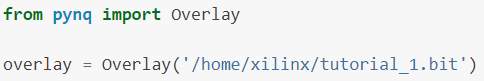
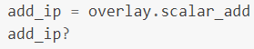
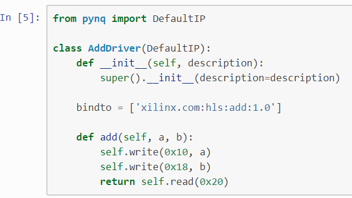
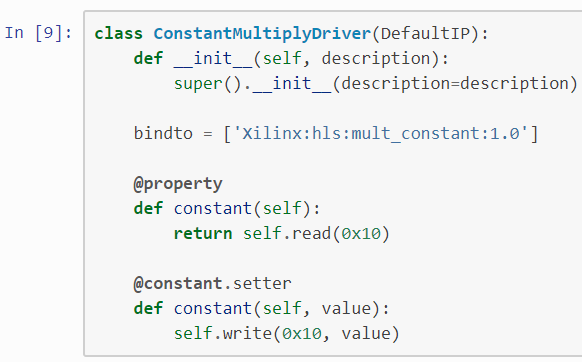
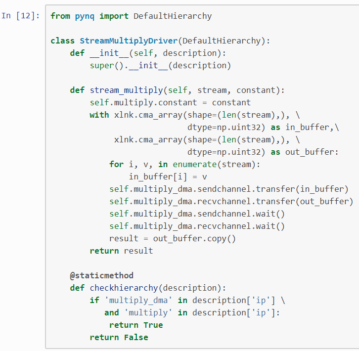
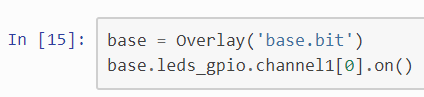
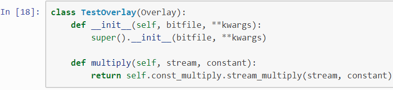
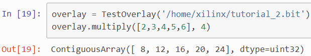

# 自定义Overlay设计

### 简介：

本章节将介绍如何设计自定义Overlay。

重新设计Overlay类有三个主要的设计目标：

a.    方便使用者采用前后一致的方式找到Overlay里包含的功能

b.    为新的硬件设计中新的IP提供简单的测试方法

c.     在不同的Overlay之间重复使用IP

本章节主要阐明了如何将新的IP在系统中互联，驱动的开发方法以及使用多个IP来创建一个复杂的系统。

### 开发一个独立的IP

在这个简单的例子中我们将使用一个通过HLS工具生成的IP，一个32位加法器。HLS源代码

<i></i>

在Vivado block design中，除了该HLS IP之外，还需要一些胶连逻辑来将该IP连接到ZYNQ7 PS侧。在本章节假设读者已经具备了基本的硬件设计基础，所以将不再包含硬件部分的详细步骤，最终在block design上的连接如下图所示：

<i></i>

为了和IP进行交互，我们需要加载包含该IP的Overlay。

<i></i>

新创建的overlay将会自动下载bitstream到FPGA，我们可以在overlay名称后面加“？”来获取overlay的内容。如下所示：

<i></i>

Overlay中所有的入口（设备）都可以通过overlay的**类属性**来访问，属性里包含了特定的驱动。

比如，通过访问Overlay中的scalar_add属性，将会为该IP创建驱动。因为没有已知和scalar_add对应的驱动，在我们和该IP交互的时候，DefaultIP将会作为该IP的驱动被使用。

<i></i>

通过读取该IP的hls源代码，我们可以知道该IP的具体使用方法，需要在在偏移地址0x10和0x18写入参数，然后从偏移地址0x20读取计算结果。

<i></i>

## 创建驱动

虽然**DefaultIP**被用来验证IP是否可以正常工作非常有用，但是对于Overlay的最终使用者来说，这样的方式并不友好。理想的情况是，我们为该IP提供一个特定的驱动，软件工程师像调用一个add函数一样来使用该硬件加速器。客制化的驱动需要继承**DefaultIP，**并根据IP类型添加一个类属性bindto。

类的构造方法使用了一个description参数，并将其传给super class的__init__构造方法。

Description是一个包含了地址分配、中断和连接到该IP的GPIO的字典。

<i></i>

在定义完新的驱动之后，如果我们重新加载overlay并查询帮助，就可以看到我们新的驱动已经和IP绑定了。

<i></i>

现在我们可以使用客制化的驱动，通过add方法取代DefaultIP来调用硬件IP。

<i></i>

## 重用IP

假设有其他人在重新设计Overlay的时候需要用到一个现成的IP。只要import包含了该IP驱动的python文件就会为该IP自动创建驱动。在本例中，我们假设在新的设计中使用了一个重新命名的Add，odd_add。

<i></i>

通过查询可知驱动也被绑定到新的overlay了。

<i></i>

<i></i>

## IP层次结构（Hierarchies）

上图中的block design中的const_multiply包含了如下的层级。

<i></i>

它包含了一个用于数据流与常量乘法的客制化IP，以及一个用于数据传输的DMA控制器（Engine）。因为流（stream）的使用，我们需要正确的控制DMA控制器中的TLAST信号，在HLS源代码中需要增加相应的progma和数据类型（types），虽然相对有一点复杂，但代码还是比较短。

<i></i>

通过查找HLS生成的文档，会发现需要通过配置偏移地址0x10寄存器的值来配置我们需要的常量。我们可以写一个简单的驱动来实现这个目的。

<i></i>

因为DMA的驱动已经存在于PYNQ的驱动中，所以只需要确保模块文件已经正确import即可。重新加载overlay可以确保我们新写的驱动生效。

<i></i>

DMA驱动会传输numpy类型的数组到事先通过xlnk()方法allocate DRAM的空间。让我们做一个测试，将5个数值与常数3相乘，获取计算结果。

<i></i>

我们会发现这种使用IP的方式对用户仍然不是很友好。更好的方式是将整个层级当作一个整体，写一个隐藏内部层级结构细节的驱动。Overlay类允许写类似于IP的隐藏层级结构细节的驱动，但细节稍有不同。

层级结构（Hierarchy）驱动需要继承pynq.DefaultHierarchy，类似于DefaultIP，它也有一个需要输入层级结构描述参数的构造函数。为了确定驱动是否应该绑定到（bind to）特定的层级结构（Hierarchy），类中包含了一个静态方法checkhierarchy，该方法会调用层级结构描述并判断驱动是否应该bind to该层次，如果是则返回True，否则会返回false。跟Default IP类似，任何满足需求的DefaultHierarchy的继承类都有一个checkhierarchy方法被自动注册。

对本设计中的常量乘法，驱动应该如下所示：

<i></i>

我们可以重新加载overlay来确保更高级的驱动被加载。

<i></i>

调用新的驱动。

<i></i>

## Overlay客制化

在很多情况下默认的overlay已经足够使用，但有些overlay也需要客制化处理来提供更加友好的API。一个例子是默认的AXI GPIO驱动提供了channel 1和channel 2两个独立的属性，这也就意味着为了访问base overlay中的LEDs设备，需要如下的操作：

<i></i>

为了移植该overlay，开发者可以提供一个客制化的类来提供一种更加友好的方式来呈现子系统。Base overlay已经包含了客制化的类来实现如下功能：

a.    使AXI GPIO设备的命名更合理、限制操作的范围和方向；

b.    让IOPs通过pmoda、pmodb、和arduino名字来访问；

c.     创建一个和RGB LEDS交互的特殊类。

这样做的结果是，LEDS可以通过如下方式访问：

<i></i>

很好定义的客制化类也可以为最终用户提供好的文档字符串。

<i></i>

## 创建一个客制化Overlay

客制化的Overlay应该继承自pynq.Overlay，获取bitstream文件的完整路径和额外的关键字参数。这些参数需要在__init__构造函数的开始即被传入到super().__init__()中，以初始化Overlay的属性。

本例将继续使用tutorial_2的Overlay，增加一个更方便调用乘法的方法。

<i></i>

为了验证新的overlay类，我们可以采用之前的方法构造一个实例。

<i></i>

## 包含的驱动

Pynq的库包含了一系列的的在pynq.lib包中定义的驱动。包括：

-  AXI GPIO

-  AXI DMA (仅simple模式)

-  AXI VDMA

-  AXI Interrupt Controller (内部使用)

- Pynq-Z1 Audio IP

- Pynq-Z1 HDMI IP
- Color convert IP
- Pixel format conversion

- HDMI input and output frontends

- Pynq Microblaze program loading