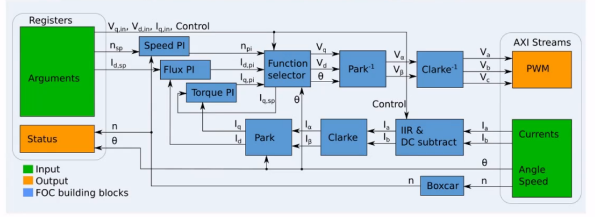

# IIoT-SPYN

IIoT-SPYN是一个开源项目，通过IIoT-EDDP和PYNQ器件，用户可以通过使用IIoT-SPYN控制、监视、捕获数据、可视化和分析汽车工业信息。


# Overlay 简介

​                                    

<p align="center">

</p>
<p align = "center">
<i></i>
</p>
上图为工程项目示意图。通过软硬件划分，在PS端中负责Linux和通信，而PL端负责实时控制部分。在PYNQ中加载bit时，PL端的控制部分将以IP核形式呈现。通过Python，对IP核的参数配置来实现控制。


 <p align="center">

</p>
<p align = "center">
<i></i>
</p>  


此项目中采用的FOC算法示意图，包括Clarke变换、Park变换、PWM编码器、PI控制器、电流采样等


 <p align="center">

</p>
<p align = "center">
<i></i>
</p>  


FOC算法模块的Vivado Block Design，可以观察到所有的算法模块都是通过Vivado HLS生成的。

 

 

 

# 如何将IIoT-SPYN安装到PYNQ-Z2 image2.3上

- 方法1（在PYNQ可以连接网络的情况下）：


  在Jupyter界面中new选项里选择新建一个终端,在PYNQ板卡能连接网络的情况下，在终端输入：

```javascript
	sudo pip3 install --upgrade   git+https://github.com/Xilinx/IIoT-SPYN.git   
```


- 方法2（在PYNQ无法连接网络的情况下）：


  下载IIoT-SPYN的zip压缩包，上传压缩包到PYNQ板卡，在终端中unzip上传的压缩包，移动到解压的目录下然后采用pip安装

```javascipt
	sudo pip3 install -e .   
	
```


# Overlay API接口介绍

在此工程中，通过Motor_Controller类来实例化一个对象进行对于电机的控制，Motor_Controller类的主要属性包括：

1. ​      __init__()：init中主要是对MMIO的配置，初始化电机的模式。

2. ​      set_mode(mode)：set_mode用于配置电机的模式，包括：“torque_mode”（扭矩模式）、“rpm_mode”（转速模式）、“reset_mode”（默认模式）。

3. ​      capture_mode(mode)：capture_mode用于配置捕获模式，包括：“ia_ib_angle_rpm”、“id_iq”、“vd_vq”

4. ​      set_torque(value)：set_torque用于配置电机的扭矩。

5. ​      stop()：stop用于配置停止电机。

6. ​      _read_controlreg(value)：_read_controlreg用于读控制寄存器。

7. ​      read_capturereg(offset)：read_capturereg用于读捕获寄存器，offset为偏移地址。

8. ​      _write_controlreg(offset,value)：_write_controlreg用于写控制寄存器，offset为偏移地址。

9. ​      write_capturereg(offset, value)：write_capturereg用于写捕获寄存器，offset为偏移地址。

10. ​     stream_capture(capture_address)：stream_capture用于捕获一系列的寄存器，capture_address为捕获地址。


# 应用案例介绍

在IIoT-SPYN的notebooks目录下包含了两个在此Overlay上的应用案例。在spyn.ipynb中介绍了通过IIoT-SPYN和EDPS板卡控制一个三相交流电动机，此案例中连接到PYNQ板卡上的是Trenz电机TEC0053。下面基于此应用案例的程序进行简要介绍：

​     通过PYNQ的Overlay库加载bit文件，在正常运行的情况下,可以看到PYNQ板卡标记为“DONE”的LED闪烁(为加载了bit文件的效果)

```javascipt
from pynq import Overlay
from pynq import MMIO
import numpy as np

overlay = Overlay("/usr/local/lib/python3.6/dist-packages/spyn/overlays/spyn.bit")
overlay.download()  
```

​    实例化一个电机控制，输出可用的电机控制模式

  ```javascipt
from spyn.lib import *
motor = Motor_Controller()
print(f'Available motor modes : {motor.motor_modes}')
  ```

​    预设置电机控制模式
 ```javascipt
motor.set_mode('reset_mode')
 ```

​     输出控制模块和捕获模块的信息
 ```javascipt
 print(f'Memory mapped IO blocks : {motor.mmio_blocks}')
 ```
   通过Jupyter交互小部件(slider)控制电机和设置电机运行模式

  ```javascipt
  from ipywidgets import interact, interactive, HBox, VBox
import ipywidgets as widgets

text = {'Motor': 'success', 'Forward': 'info', 'Reverse': 'warning'}
buttons, colors = list(text.keys()), list(text.values())

toggle = [
    widgets.ToggleButton(description=f'{buttons[i]}',
                         button_style=f'{colors[i]}')
    for i in range(3)]
mode = widgets.Dropdown(options=['Speed', 'Current'])


def clicked(toggle_0=toggle[0], mode=mode, toggle_1=toggle[1],
            toggle_2=toggle[2], RPM=None, Torque=None):
    if toggle_0:
        if mode == 'Speed':
            motor.set_mode('rpm_mode')
            motor.set_rpm(RPM)
        elif mode == 'Current':
            motor.set_mode('torque_mode')
            motor.set_torque(Torque)
    else:
        motor.stop()


w = interactive(clicked,
                RPM=widgets.IntSlider(min=-5000, max=5000, step=1, value=1000),
                Torque=widgets.IntSlider(min=-400, max=400, step=1, value=0))
VBox([HBox(w.children[:2]), w.children[2], w.children[3], w.children[4],
      w.children[5]])
  ```

   

​     读取状态寄存器的相关信息
 ```javascipt
 motor_status = [(motor._read_controlreg(i + ANGLE.offset)) for i in
                range(0, 16, 4)]
high_sp, low_sp = bytesplit(motor_status[1])
high_id, low_id = bytesplit(motor_status[2])
high_iq, low_iq = bytesplit(motor_status[3])

print(f'Angle in degrees : {motor_status[0] * 0.36}')
print(f'Angle in steps per thousand: {(motor_status[0])}')
print(f'Id : {np.int16(low_id) * 0.00039} Amp')
print(f'Iq : {np.int16(low_iq) * 0.00039} Amp')
print(f'Speed in RPM : {-(np.int16(low_sp))}')
 ```


    通过一个循环测试电机的运转
 ```javascipt
 import time
motor.set_mode('rpm_mode')
for i in range(2):
        motor.set_rpm(1000)
        time.sleep(1)
        motor.set_rpm(0)
        time.sleep(2)
        motor.set_rpm(-50)
        time.sleep(2)
        motor.set_rpm(0)
        time.sleep(2)
motor.stop()
 ```

 捕获模式输出及选择
 ```javascipt
    print(f'Available stream capture modes : {motor.motor_capture_modes}')
    motor.capture_mode('ia_ib_angle_rpm')
 ```

   通过Xlnk类为捕获的流数据分配DMA
 ```javascipt
 from pynq import Xlnk
xlnk = Xlnk()

input_buffer = xlnk.cma_array(shape=(256,), dtype=np.uint8)
capture_address = input_buffer.physical_address
print(f'Physical Address of data stream capture: {hex(capture_address)}')
 ```

    按照控制方式来记录流数据
   ``` javascipt
    from pynq import MMIO

# capture_count = int(input('Enter capture count: '))
capture_count = 1000

def continuous_capture(capture_count):    
    mmio_stream = MMIO(capture_address, 256)
    cap_list = [([]) for i in range(4)]
    for _ in range(capture_count):
        motor.stream_capture(capture_address)
        for i in range(4, 260, 4):
            stream = mmio_stream.read(i - 4, 4)
            highbits, lowbits = bytesplit(stream)
            if (i % 8 != 0):
                cap_list[0].extend([(np.int16(lowbits))])
                cap_list[1].extend([(np.int16(highbits))])
            else:
                cap_list[2].extend([(np.int16(lowbits))])
                cap_list[3].extend([(np.int16(highbits))])
    return cap_list

cap_list = continuous_capture(capture_count)
Ia, Ib, angle, rpm  = cap_list[0], cap_list[1], cap_list[3], cap_list[2]

current_Ia = np.array(Ia) * 0.00039
current_Ib = np.array(Ib) * 0.00039
   ```

   通过matplotlib将得到的数据通过图像表示出来
     ```javascipt
     %matplotlib inline
     import matplotlib.pyplot as plt
     fig = plt.figure(figsize=(20, 10))
     ax = fig.add_subplot(111)
     ax.plot(current_Ia)
     plt.show()
     ```

    停止电机并且重启xlnk以免发生内存泄漏

  ```javascipt
 xlnk.xlnk_reset()
 motor.stop()
  ```


```

```

```

```

```

```