# 前言

Python 是一个高层次的结合了解释性、编译性、互动性和面向对象的脚本语言。

Python 的设计具有很强的可读性，相比其他语言经常使用英文关键字，其他语言的一些标点符号，它具有比其他语言更有特色语法结构。

- Python 是一种解释型语言： 这意味着开发过程中没有了编译这个环节。类似于PHP和Perl语言。

- Python 是交互式语言： 这意味着，您可以在一个Python提示符，直接互动执行写你的程序。

- Python 是面向对象语言: 这意味着Python支持面向对象的风格或代码封装在对象的编程技术。

 

Python的另一大优势与便利性在于其开源性。网络上有相当多且高效有用的开源库可供我们进一步开发使用，比如著名的矩阵计算库numpy，科学计算库scipy等等。PYNQ已经为我们预装了这些有用的库，我们先来介绍一下python的基础用法，并在最后一小节讲讲如何使用pip来添加查询新的库。

通过键入关键词import，空格后按下tab即可查看所有已经安装的库。如图所示：

<i></i>

# Python常用辅助函数

当我们使用（import）一个新的库的时候，我们常常不知道这个库有什么，该如何使用这个库。这个时候我们就可以借助两个关键的函数：help(), dir() 来帮助我们了解库的使用。我们以asyncio库为例。

<i></i>

导入库后，我们首先调用help函数，help函数会给我们提供asyncio库的制作者所写的帮助文档。通过这个文档，我们可以非常轻松的了解库里有哪些函数以及这些函数有什么作用。但是有的时候，我们希望可以更快的寻找我们需要的函数而非阅读全部的帮助文档。此时我们即可借助dir()函数。

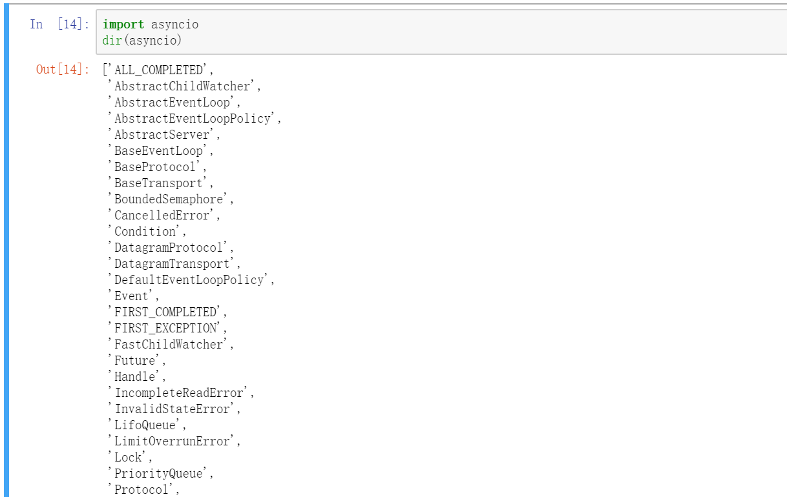

<i></i>

dir()函数以列表的形式提供了所有该库下可调用函数或子库，此时我们可以更容易的找到我们需要的内容。假如我们对图中的Condition模块感兴趣，我们只需键入help(asyncio.Condition)即可查看该模块的详细信息。

<i></i>

依赖help与dir，我们通常就可以快速达成我们对所需要函数的快速检索以及使用，这对我们日后开发程序是非常有帮助的。事实上，help的功能更加广泛，我们可以对任意我们已经定义了的变量进行help来获得详细信息。

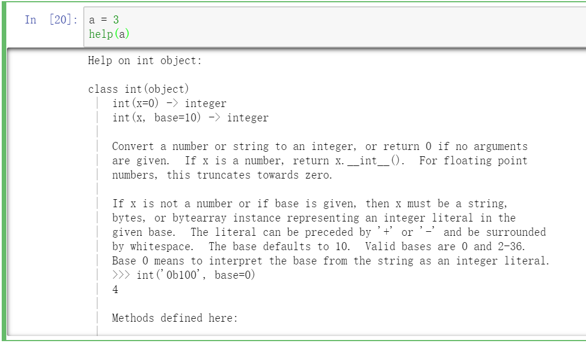

<i></i>

# Python基础知识概览

与其他语言不同，python的变量定义无需申明类型，直接拿来定义即可。这是因为python的所有变量类型都是以object（对象）定义的。在上一小结末尾，我们定义了a = 3，通过help可以看到，a是一个int object（整数对象），这也是python的一大特色。Python通过名字空间与对象空间的链接达成了对变量的管理。具体来说，当python执行a = 3的时候，它首先在对象空间里创建一个int object，其值为3，接着在名字空间里创建（或寻找）变量名a，将其指向对象“3”。贴切的说，a里存储的并不是3，而是“3”这个对象的地址。此外，对象名只能由英文数字下划线组成且数字不能作为开头，变量名区分大小写。

Python基础的对象主要有int（整数），float（浮点数），str（字符串），list（列表），tuple（元组），dict（字典），set（集合）。集合相对来说不怎么常用，这里不予讨论。Int与float同其他语言一致，包含基本的加减乘除（+-*/）以及整除（//）取余（%）幂次（**），如下所示：

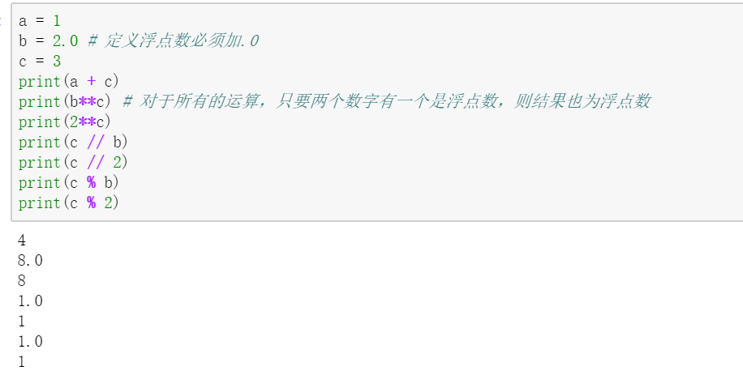

<i></i>

字符串对象可用单引号‘string’、双引号“string”、三单引号‘‘‘string’’’或者三双引号“““string”””表示，但是通常三引号用作注释说明，一般只使用单引号与双引号。

与其他语言不同，python并没有数组对象array，相对的，其有元组(value1, value2, …)与列表[value1, value2, …]，两者唯一的区别在于元组是一个不可变对象——无法添加删除新的元素、无法变更元组内不可变对象的值（这列可能有点拗口，但是如果某个value是可变对象比如列表，则仍然有办法修改里面的值），而列表为可变对象（增改删查皆可）。基本操作如下所示：

<i></i>

在上面的示范里，我们可以发现a + . + function的用法。正如前面介绍，这正是因为列表a也是一个对象，而python调用对象方法的语法便是对象名object + . + function。

最后是字典对象{key1: value1,…}其采用键值对组合。其中键（key）必须为不可变对象，值（value）可为任意对象。字典本身为可变对象，即可增改删查，这里只介绍最基本的增与改。

<i></i>

# Python简单实例——分解因数

这一节，我们将通过一个简单实例来了解python的一些基本操作：函数定义、条件判断、for循环迭代。代码如下：

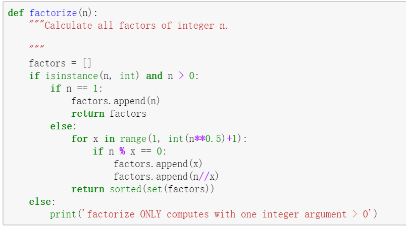

<i></i>

为了实现代码的整洁与重复使用，函数的定义是必须要掌握的。Python中使用关键词def + function_name(arg1, arg2, …)来定义函数。上面代码就定义了一个名为factorize的函数，其参数为n。我们注意到，与其他的语言不同，python并没有各类括号来划分代码块，因为其采用的是冒号“:”加缩进（tab）的形式来划分。冒号为缩进提示符，因此必不可少，下面处于同一级别缩进的都属于def的函数范围。当然，缩进也可以嵌套，子缩进属于父缩进。若要结束函数定义，只需退回到和def的缩进级别（0缩进）即可。下图展示了def的具体形式。

<i></i>

函数定义的时候可以指定任意多个参数，同时也允许赋予默认值。但是拥有默认值的形参必须排在最后。即上面的图示中，若写成arg1，arg2 = 3， arg3，便是非法的。函数最后可以使用关键词return来返回函数体中的数据，且一旦碰到return，函数调用就结束了。上面的示例中我们返回了arg1，因此q得到的值就是func(4,6)里的4。有的时候，为了能让别人读懂函数的作用，我们通常会在def的下一行增添注释，也就是因素分解实例中的三引号部分。

回到实例，在函数内部，我们首先定义了空列表factor，随后使用了选择分支结构if….else，其具体结构如下所示：

<i></i>

其中只有if是必要的，并且采用冒号+缩进的方式提示程序代码块到何处结束。Elif和else是分支选项，可有可无，elif可以写多个，而else只能有一个，他们都与if同级缩进。

最后是for循环结构，语法如下：

<i></i>

注意到与别的语言不同，for循环并不是只能迭代次数循环，iterate_unit可以是任何一个可迭代对象，常见的有元组、列表、字符串。每一次迭代的内容会赋给item，通过对item进行操作来完成循环目的。在实例中，我们的循环部分首先使用内置函数range(start, stop, step)生成了一个可迭代对象，并通过循环该对象完成因数分解操作。其中range函数返回的是一个从start开始（包含start）至stop结束（不包含stop）且间隔为step的整数列列表（比如range(0,6,2)返回的的是[0,2,4]）。

了解了if和for后，我们再纵观整个程序一遍。程序首先判断输入的n是否是一个可以被因数分解的对象，随后从1至 根号n遍历，找到所有的因数（即可以被整除），并将因数添加至列表factor，最后返回列表。

有关更多的python教程，还请找专门的书籍自行学习。

# Python库的使用

我们之前说过，python的强大之处在于其丰富的开源库，我们接下来以Numpy与pynq的结合为例稍微的体验一下库的运用。

<i></i>

<i></i>

Numpy包为我们提供了传统的数组形式，而pynq包则为我们在numpy的基础上进一步封装，使得其成为了可被PYNQ板的ARM处理器可处理的形式。换而言之，我们可以用numpy包来处理从硬件上搜集的数据，也可以用pynq包把数据包装后传回硬件。我们要写的只不过是一行代码，其内部具体的实现原理无需我们推敲，这正是python的开源性为我们带来的便利性。如果想知道函数的具体用法，我们只需使用help即可。如图所示：

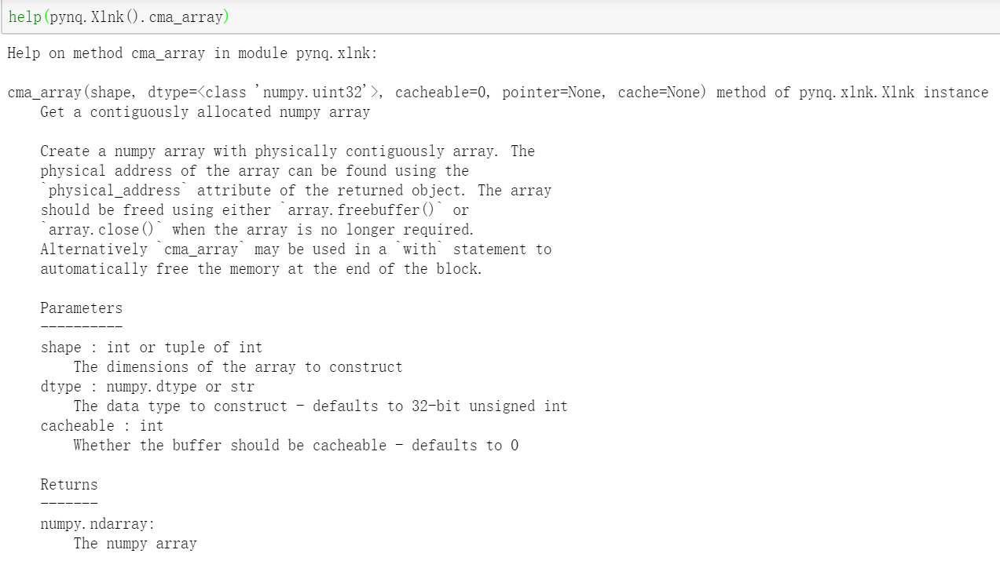

<i></i>

# Python高级实例——异步IO操作

在与可编程逻辑设备通过事件交互的时候，python3.5以后的版本的asyncio模块可以发挥巨大的优势（PYNQ已经搭载了3.6版本）。我们可以使用这个模块来异步处理PYNQ板上的多个IO任务，这样就可以避免有的IO占线太长而导致其他IO操作堵塞。也就是说，程序可以优先处理准备好运行的了IO任务，最后再回过头去把占线的任务解决掉。

当然了，这里我们并不知道我们的可编程逻辑设备上运行的是什么，所以我们这里仅仅在程序上模拟一下异步处理（即使用下面的asyncio.sleep方法达成占线操作）。代码如下：

<i></i>

我们在定义函数关键词def前增加关键词async，即可定义“异步函数”，其余语法不变。我们称一个异步函数为协程（Coroutine），其特点是只允许在其内部的出现的await操作（await出现在async def以外的地方会提示语法错误）。关键词await 允许该协程在此处中断，先去执行其他协程，并在await后的内容结束后立即回到原先协程继续执行未完成的代码。在上面定义的函数中，我们用asyncio.sleep来模拟IO的占线操作（这里我们不可以使用time.sleep，因为await后必须是一个Awaitable对象，asyncio.sleep相当于协程版的time.sleep），在实际操作中，我们await后加的可能是另外一个IO操作协程。接下来，我们就用这个函数来模拟异步IO操作。代码如下：

<i></i>

为了体现出异步处理的强大，我们特地让第二个IO任务的执行时间高于第一个IO任务。从输出可以看到，两个协程的开始时间是几乎一致的。也就是说，当第一个任务运行到await后，并未等待占线结束，而是直接运行第二个协程。当第一个协程的5s结束后，程序并没有等待运行中的第二个协程的8s操作，而是中断回到第一个协程继续后面的操作，当8s过后再回过头去执行第二个协程。

# Pip的使用

简介提到，Python为我们提供了相当多的优质的库，同时，python也为我们提供了专门的库管理工具——pip。通过pip，我们可以非常简单的下载安装新的库。本小节就来介绍如何给PYNQ板装新的库。

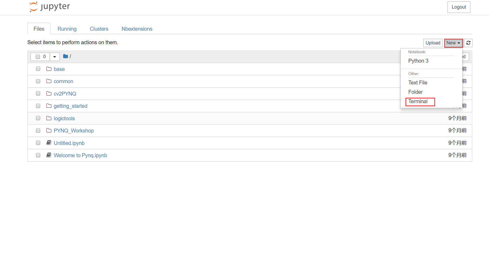

<i></i>

首先，我们打开PYNQ的Jupyter，并在New下找到Terminal，点击后进入终端操作界面。界面如下：

<i></i>

接着我们输入sudo pip3或者sudo pip3.6测试一下自己的pip命令是哪一个（对于sd卡里烧写了不同版本的PYNQ来说，命令可能不一样），之后附加的命令内容均一致。

<i></i>

这里使用的sudo pip3.6命令， 首先我们键入sudo pip3.6 list，即可列出所有已安装的库。

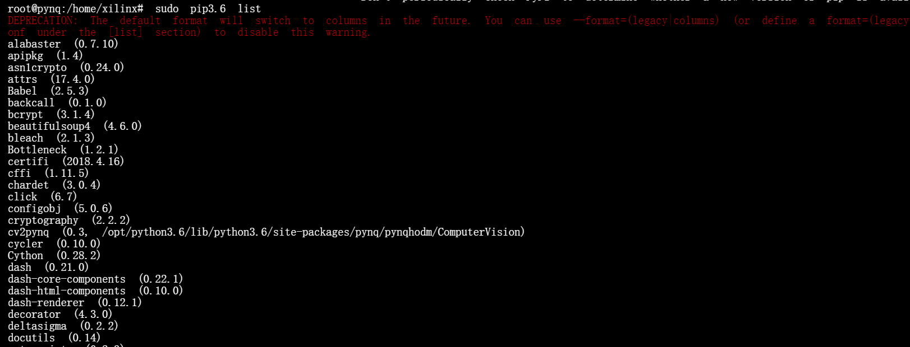

<i></i>

这里的列表因人而异，因为自己电脑上本来就装过的库也是可以调用的。

至于安装新的库，有两种方法。第一种通过电脑联网下载库的文件夹（下图为整个文件夹的内容，该库为cv2pynq），该文件夹里有着setup.py用以帮助安装。

<i></i>

首先，我们把整个文件夹通过samber传输文件的方法拷贝至PYNQ的pynq文件夹内。这里我将文件夹取名为pynqhodm。

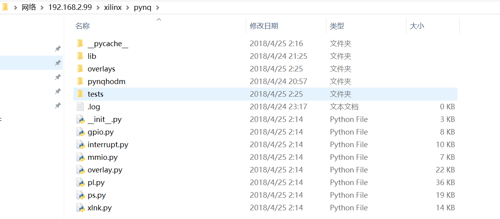

<i></i>

打开jupyter notebook的终端，转移到当前文件夹，语法是 cd pynq/YOUR_FILENAME，成功后，命令行的前缀会变为如下所示：

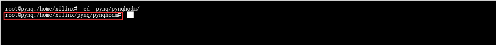

<i></i>

接着我们运行安装命令“sudo pip3.6 install –e .”，注意，这个末尾的“.”不可漏！ 

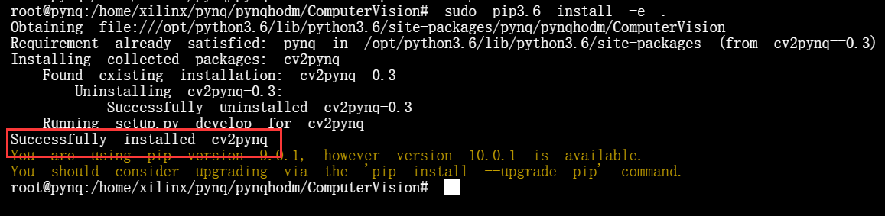

<i></i>

提示了Successfully之后即表明安装成功。

第二种方法，需要pynq连接上电脑以及外网，经过测试，我们需要使用v2.3版本的镜像。也即pip命令为sudo pip3的版本。

第一步，我们需要确保我们的板子连上外网，为此，你需要你的电脑连上外网。打开网络和Internet设置界面，找到更改适配器选项。

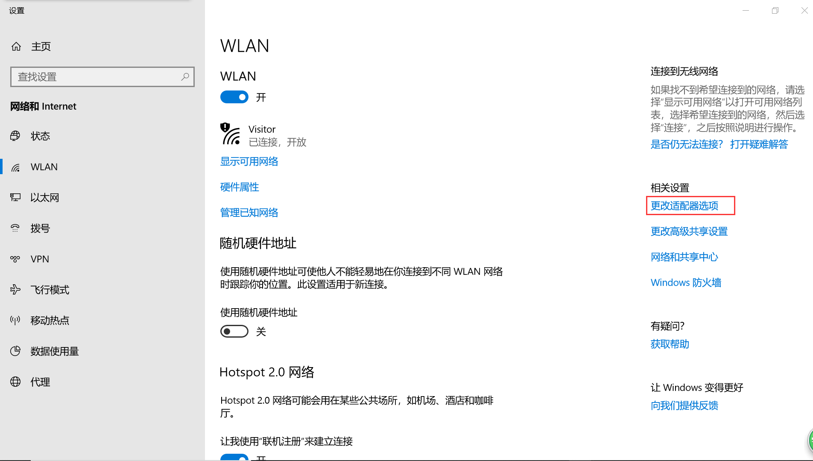

<i></i>

<i></i>

可以看到我们连接到外网的WLAN以及连接到板子的以太网。我们右键WLAN找到属性界面。

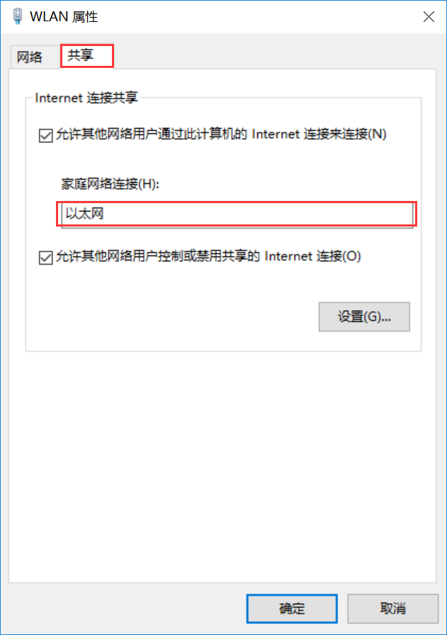

<i></i>

在共享界面，选择板子连上的以太网进行共享。点击确定，若跳出提出弹窗，点击确定即可。

此时，由于共享了网络，我们板子的IP地址不再是默认的192.168.2.99，而是改成了动态配置IP地址。因此第二步是找到板子串口的新IP地址。我们需要上网下载一个工具来连接串口。

登录网址[https://www.chiark.greenend.org.uk/~sgtatham/putty/latest.html](https://www.chiark.greenend.org.uk/~sgtatham/putty/latest.html获得putty) 获得putty工具。下载适合自己系统的版本。

<i></i>

安装完成后，打开putty。

<i></i>

接下来我们需要找到自己的Serial port。打开控制面板，在硬件和声音里找到设备管理器。

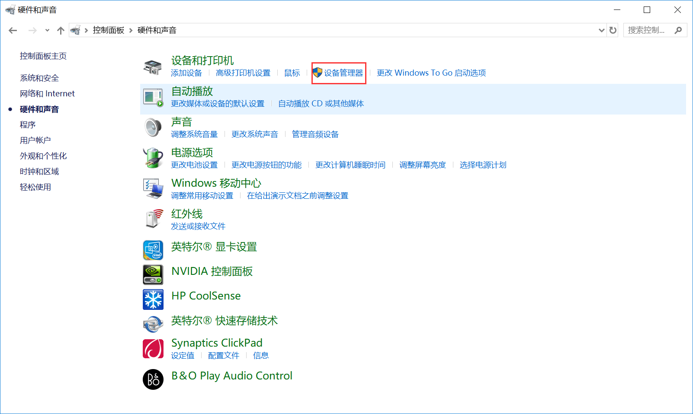

<i></i>

在设备管理器的端口下找到自己的端口。

<i></i>

图中为COM5。

<i></i>

填写完上述三个配置后，点击open。（speed栏固定115200）

打入回车后，出现如下界面。

<i></i>

输入命令ifconfig后，即可查看串口IP地址。

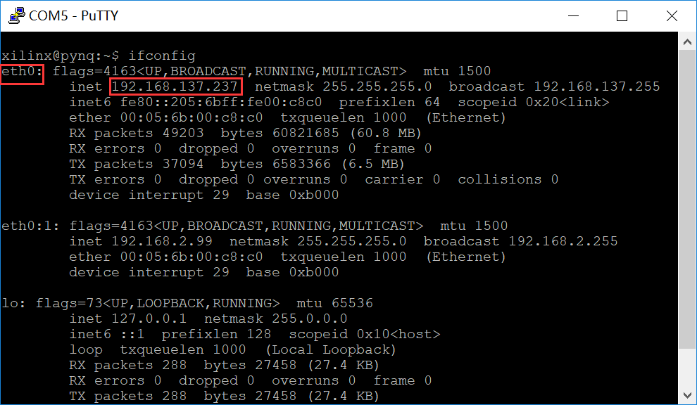

<i></i>

打开浏览器，即可用该ip地址登录jupyter notebook。

最后一步，打开terminal终端，输入sudo pip3 install package_name 即可直接安装新的包。以Luminoth为例。

<i></i>

倘若包确实存在却碰到失败，多半是因为网络延迟造成，尝试多次执行安装命令即可。