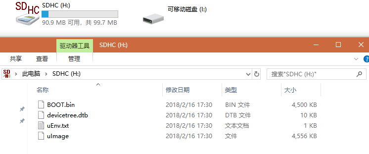
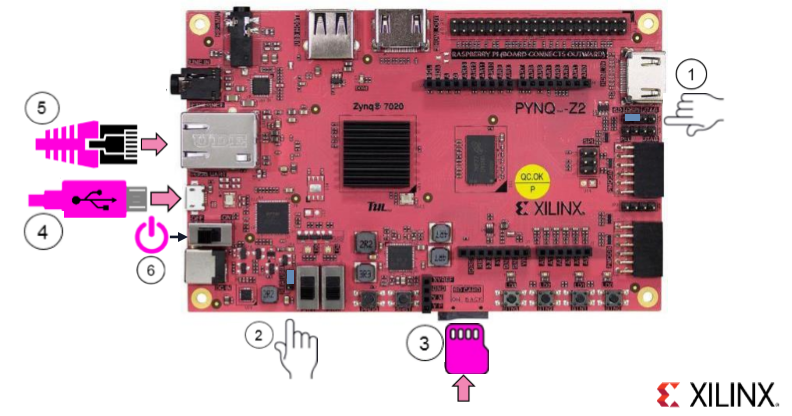
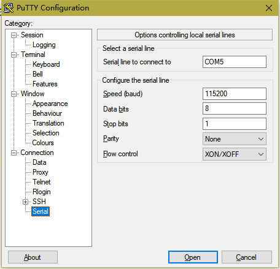
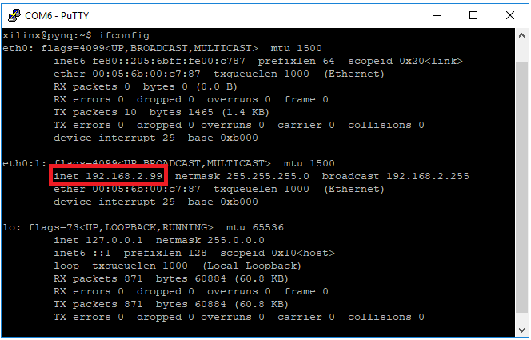
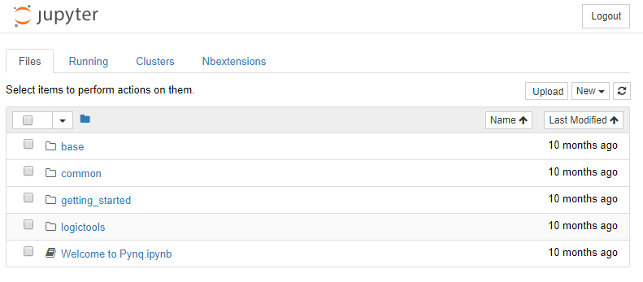
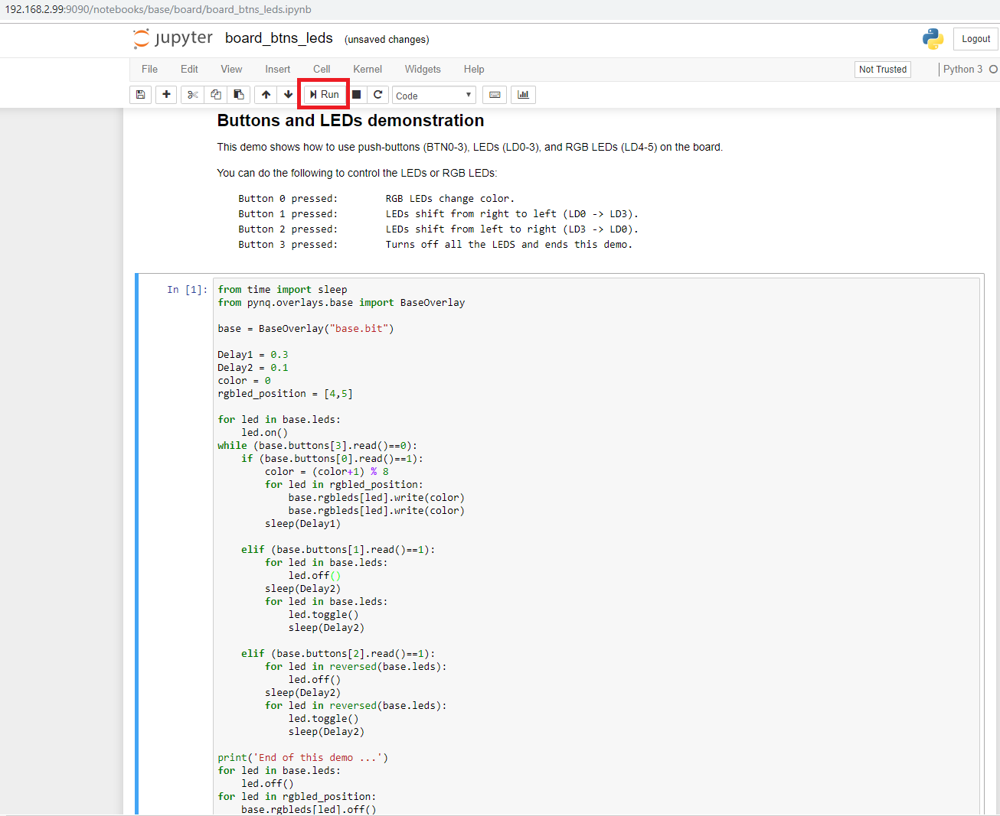

# 01\_PYNQ-Z2开发板上手

在开始之前，你需要准备好如下物品：

* PYNQ-Z2开发板
* 装有最新版本Chrome浏览器的PC机
* 一根百兆/千兆网线
* 一根Micro USB线
* 至少8GB大小的Micro SD卡

## 制作Micro SD卡

这一步的任务是制作一张可启动的Micro SD卡。在制作Micro SD卡之前，请确认你已经准备好下列物品：

* 一台可以读写Micro SD卡的电脑，或者Micro SD卡读卡器
* PYNQ-Z2开发板的PYNQ镜像，可在[http://www.pynq.io/board.html下载](http://www.pynq.io/board.html下载)
* 镜像烧录工具。根据不同的操作系统有不同的推荐：
  * Windows：可通过镜像烧录软件，如Win32DiskImager，官方下载链接为[https://sourceforge.net/projects/win32diskimager/](https://sourceforge.net/projects/win32diskimager/)
  * Mac OS X/Linux：dd命令行_sudo dd bs=4M if=pynq\_z1.img of=/dev/sdd_

以在Windows下制作可启动的Micro SD卡为例。

打开Win32DiskImager，并根据开发板选择下载好的镜像文件，PYNQ-Z2.img。

选择MicroSD卡对应的盘符（请务必正确选择），点击写入然后等待完成。

 烧录完成之后可以看到对应的Micro SD盘符如下图所示。

 Micros SD卡内被划分为两个分区，本例中99.7MB大小的FAT分区挂载的是Linux中的\*\*/boot\*\*分区，内部存放的是Boot.bin等启动所需文件。另一个ext4格式的分区在Windows中不可读，挂载的是根目录\*\*/\*\*分区。 \#\#\# 启动开发板 开发板启动步骤如下： - 配置成SD卡启动模式 - 配置为USB供电模式 - 把上一小节中制作好的Micro SD卡插入对应的卡槽 - 将Micro USB线连接到板板卡与PC（该线缆用于板卡供电/串口通讯/JTAG调试）。 - 将网线连接到板卡与PC机对应的接口，PC上配置本地网络静态IP为192.168.2.1，子网掩码为255.255.255.0。\(也可以通过路由器为PC机与板卡建立网络连接，PC机自动获取IP即可） - 打开电源拨码开关，等待板卡启动完毕。（可在串口观察系统启动打印信息，连接方式请参考下一小节）

## 与PYNQ-Z2建立串口连接

串口连接需要专门的串口连接软件来操作，这里我们推荐使用开源免费跨平台的PuTTY来进行连接。下面将只介绍Windows上的操作，mac和Linux上的操作类似。

首先我们需要知道串口端口号，打开**设备管理器**，展开端口列表即可看到，如COM5。

打开PuTTY软件，输入USB端口号和下列串口参数，点击连接即可。

* 波特率115200 Speed
* 数据位 8 Data bits
* 停止位1 Stop bits
* 奇偶校验 None Parity
* 流控制 No Flow Control

## 连接Web UI: Jupyter Notebook

在这一小节中，我们将通过浏览器打开板载Linux上运行的嵌入式Web服务器Jupyter Notebook的页面，感受不一样的编程体验。

如果开发板是直接网线连到PC上的，默认的=192.168.2.99。如果是通过路由器建立的网络连接，则需要查询板卡的IP地址。通过putty软件在串口终端输入_ifconfig_命令即可查询到板卡的IP地址。

打开Chrome浏览器输入 http://:9090 ，记住将替换为具体的IP，输入密码**xilinx**，即可进入到开发板上的Jupyter Notebook主页。推荐使用Chrome浏览器是因为Jupyter Notebook使用了许多最新需要浏览器支持的js框架。

主页中展示的例子可以让我们快速上手PYNQ相关的操作，base文件夹和logictools文件夹与具体的Overlay应用相关（Overlay的概念后面会介绍），common文件夹中的是与具体Overlay不绑定的较为通用的例子。对新手来说，getting\_started文件夹提供了了解PYNQ必知必会的几个例子，我们也建议读者朋友先从这里入手。

我们以PYNQ上自带的/base/board/board\_btns\_leds.ipynb为例，打开该notebook。点击Run按钮运行该notebook，根据notebook中的介绍操作按钮，观察板卡的运行状态。

如果对Jupyter了解有限，可以先看本章后面的JupyterNotebook必知必会对它有一个初步的使用印象，再去进行下一步操作。

## 通过samba传输文件

在开发过程中，如果需要在PC机与板卡之间传输一些较大的文件，可以通过PYNQ支持的samba协议将PYNQ的文件系统当作一个网络硬盘直接读取。在Windows中只需要打开资源管理器，输入\\xilinx即可成功连接。在Mac/Linux中同样可以打开文件管理器，输入smb:////xilinx进行挂载。注意，用户名和密码均为**xilinx**。

