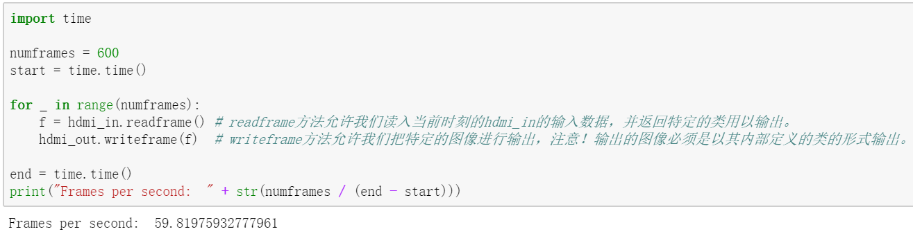
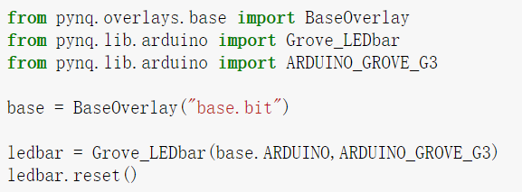

# 05\_BaseOverlay介绍

## PYNQ-Z2 BASEOVERLAY

PYNQ-Z2上的base overlay所涉及的硬件如下：

* HDMI接口（输入输出）
* Audio codec
* 4个绿色LED，2个彩色LED，两个开关，四个按钮
* 两个Pmod PYNQ Microblaze
* Arduino PYNQ Microblaze
* RPI \(Raspberry Pi\) PYNQ MicroBlaze
* 4个跟踪分析器（PMODA,  PMODB, ARDUINO, RASPBERRYPI）

## HDMI

PYNQ-Z2板上有HDMI输入与HDMI输出端口。HDMI接口是直接连接到可编程逻辑引脚上的。在板上没有外用的HDMI电路。HDMI接口是由可编程逻辑模块的HDMI IP控制的。

HDMI IP是链接到处理系统DRAM上的，视频可以以流的方式从HDMI输入端进入内存，然后再从HDMI输出端流出。这就允许我们通过python来处理视频数据，或者干脆通过python写一段视频流然后再由HDMI输出。

虽然Jupyter notebook支持内嵌的video形式，但是我们从HDMI捕捉到的视频数据会是原生的，如果不进行适当的编码处理，将无法在notebook上直接播放。

### HDMI IN

HDMI输入端IP可以捕捉标准的HDMI分辨率。在HDMI资源被连接后，HDMI控制器就会启动，并自动检测输入的数据。分辨率情况可以从Python 的HDMI类里读取，图像数据也可以流入处理系统DRAM。

### HDMI OUT

HDMI输出端IP支持一下分辨率：

* 640x480
* 800x600
* 1280x720 \(720p\)
* 1280x1024
* 1920x1080 \(1080p\)

数据可以从处理系统DRAM流到HDMI输出端。HDMI输出控制器能通过帧缓冲器来达到视频数据的流畅播放。

接下来，我们就来讲解如何使用HDMI，其源代码都可以在板上的getting\_started文件夹下base\_overlay\_video里找到。（我们使用的设备是1080p）

首先，我们得准备一个满足上述条件的输出显示屏，两根HDMI-HDMI线。将HDMI IN端与电脑相连，再将HDMI OUT端与准备的显示屏相连。打开我们的Jupyter Notebook。

第一步，如前面介绍，导入我们的base overlay，转化“base.bit”文件，这样我们就可以使用里面封装好的API了。我们使用base里的video模块来进行视频处理。Video模块下又分为hdmi\_in类与hdmi\_out类来分别处理HDMI IN流和HDMI OUT流。

第二步，我们得先对hdmi\_in和hdmi\_out进行相关配置，可以通过help来对configure进行一定了解。如下图所示：

可以看到，hdmi\_in的configure函数只有一个参数pixelformat，并且有默认参数，通常情况下我们使用默认参数即可。并且从介绍中我们可以看出，在配置前我们必须先确保pipeline是处于非运行的状态。我们在之后会介绍其他的pixelformat状态。

Hdmi\_out的configure函数与Hdmi\_in的有所不同，多了一个mode参数，这是因为我们需要选择输出的模式。Mode参数传递的是一个定义好的对象，不是我们自己随便写写就能出来的。我们需要使用pynq.lib.video下的VideoMode类来创建正确的参数信息。幸运的是，hdmi\_in对象为我们保存了输入的模式，我们可以先直接拿过来使用。至于pixelformat，我们选择默认的即可（即不用填写）。

配置好后，还得记得运行hdmi\_in.start\(\)和hdmi\_out.start\(\)来让输入输出端正确工作起来。此时，我们连接的显示屏应该会从蓝屏变为黑屏。

第三步，为了让屏幕有点什么，我们可以先尝试一下最简单的镜像，也就是把电脑屏幕拷贝到显示屏上。只需要输入hdmi\_in.tie\(hdmi\_out\)即可。我们也可以通过这个来检测屏幕是否有异常。

但是这样的话，我们无法对输出进行任何修改，只是单纯的拷贝了一个屏幕而已。为此，我们可以拆分输入输出的整合过程，这样就有了修改输出的余地。

我们运行上述代码，我们观察到屏幕在不断闪屏后最后不在变化。这是因为我们手写的输入输出没有任何缓冲，导致刷新不够快，被视觉捕捉到。由于上述程序for循环运行完后没有了后续输出，屏幕自然不会变化了。从输出结果我们可以看到刷新频率约为60fps。

但是，碍于处理器的性能最高只能做到60fps，如果在这之间加入一些帧处理的操作会使得实际帧数远远低于60fps，尽管如此，我们还是可以用其很好的进行图片处理。

比如我们假装使用了一个耗时0.1s的操作后再输出图像。运行程序后可以看出，虽然输出屏幕不再因为过快刷新而导致闪屏，但是屏幕流畅度大幅下降（约10fps）。

接下来，我们使用cv2库来尝试对得到的图像做一些简单的处理，下面的例子将只对屏幕做去色处理（即变成灰白界面）。

运行程序后可以看到，屏幕去掉了颜色且反转了颜色，并且在运行的时候更加卡顿，这是因为图像处理使得帧率掉到了1.4fps。

第四步，处理完所有的程序，我们还要调用close函数来释放所有资源。至此，一套完整的video处理基本完成了。

当然了，只是简单的去色这件事，我们可以通过其内置的模式简单的办到。通过在hdmi\_in的configure函数增添pixelformat参数，即可达成。如下图所示：

由于去色是基于其更底层的代码，运行效率大大提高。现在，我们重新在尝试一下反色处理。注意！这里的PIXEL\_GRAY是由于我们之前运行过from pynq.lib.video import \*，这个语法允许我们直接使用pynq.lib.video里的变量名而无需加前缀。

可以看到，处理速度近乎翻了3倍。

当我们使用PIL库进行图像处理时，还有两个很好用的模式。第一个是常规的RGB模式。通过PIL库，我们可以很轻松的把hdmi\_in读入的图像打印到notebook上。代码如下所示：

另外一个模式是YCbCr，在一些图像处理算法与输出JPEG图像中很有用。我们采用如下方式进行更改：

通过PIL库，我们还是可以很轻松的读取这种格式的图并将其转化成RBG：

完成了操作后，不要忘记使用close函数来解放程序的占用。

事实上，PYNQ-Z2还为我们准备了人脸识别以及边缘检测这类高级应用，我们可以在base/video/文件夹下找到这些示例。

## IOP-Pmod

Pmod包是一个使用Pmod端的外部设备的驱动集合。一个Pmod端口是一个12引脚接口，很多来自Digilent和其他第三方合作生产商的Pmod设备都可使用。传统的Pmod外接设备包括了各式传感器（光、温度）、交互设备（网口、WIFI、蓝牙）以及输入输出设备（按钮、开关、LED）。

每一个Pmod连接器是由2排6引脚共计12引脚构成的。每一排由3.3V\(VCC\),接地\(GND\)以及4个数据引脚构成。如果使用两排的话那就是8个数据引脚。

Pmod使用双排引脚时（2x4引脚或者2x6引脚），应该从左边开始插入（以连上VCC和GND）

而只使用一拍的Pmod设备可以使用任意一排，但还是要从左边开始插入。如果你要使用一个别人写好了的驱动或者overlay的话，你需要检查到底那一排是支持这个设备的，并不一定是两排都能成功。比如说，Pmod ALS目前就只支持上面一排的端口。

所有的引脚都在3.3V时正常工作。根据不同设备的不同pull-up/pull-down I/O要求，Pmod数据引脚会有不同的IO标准。（例如IIC需要pull-up，SPI需要pull-down）

引脚0,1和4,5是连接到pull-down电阻器。这个可以支持SPI接口以及大部分外接设备。引脚2,3和6,7是连接到pull-up电阻器。这个可以支持IIC接口。

Pmod已经把这个pull-up/down传统考虑进去了，所以在使用Pmod的时候无需额外担心。接下来让我们看个Pmod的例子。同样的，代码我们都可以在base/Pmod下找到

## OLED

我们需要找一块OLED并将其连接到PMODA上。运行上述代码。

首先，同样的，我们需要导入base.bit文件。并在pynq.lib里导入响应的Pmod模块。在初始化响应模块的时候，我们需要告诉处理器我们使用了那个接口。因此在初始化pmod\_oled的时候，需要加入配置信息，也就是base.PMODA，如果用的是PmodB接口则只需用base.PMODB来初始化即可。

该模块的使用非常简单，通过help可以看到其只支持四个方法，分别是清屏、画线、画矩形、打印文字。使用help\(\)即可查看具体使用方法。

## TC1传感器

接下来我们介绍一下热电偶（thermocouple）传感器的使用方法。我们需要相应的TC1传感器模块。

 这次我们尝试一下PMODB接口，同样的，从pynq.lib里导入Pmod\_TC1类，并初始化该模块。上面的代码给出了基本的读取数据方法。 除了数据读取，传感器还为我们提供了数据记录的方法，方便我们根据时间轴来分析传感器数据。通过set\_log\_interval\_ms函数我们可以设定采集数据的时间间隔，默认是以1秒钟为间隔。 我们使用!\[\]\(images/Chapter\_05/21.png\)方法开始记录数据，并用!\[\]\(images/Chapter\_05/22.png\)结束数据记录。之后，我们只需要使用!\[\]\(images/Chapter\_05/23.png\)即可调出数据。但是注意，Pmod记录的数据只是传感器采集到的原始数据。我们需要特定的函数为我们转换成有用的数据。

 在pynq.lib.pmod.pmod\_tcl里，为我们准备了相应的转换函数，其中reg\_to\_tc是转换成温度，reg\_to\_ref转换成相对指标。 其他的Pmod设备的使用方法均大同小异。通过dir\(pynq.lib\)我们可以看到，其自带的方法有如下几类：

我们可以在base/pmod下找到大部分例子。

## PMOD-Grove

除去Pmod外接设备，我们还有Pmod-Grove外接设备，它为我们提供了更多的零件。我们需要下面这个转换器来使用Grove套件。

在PYNQ Grove转换器上，一共有G1、G2、G3、G4四个端口，分别按照下图做了映射。如引脚0、4对应了G1端口。端口G1和G2支持SPI协议、GPIO以及timer Grove外接设备，但是不支持IIC设备。端口G3和G4对应另外一半引脚，支持IIC协议和GPIO外接设备。

接下来我们举个例子。

#### Grove LedBar

我们先将该设备与Grove Adapter连起来并插入PMODB上，由于它是由GPIO驱动，所以四个插口都可以达到目标，这里我们选取G1。

与以往一样，我们先从base.bit中得到各种配置参数。接着，从pynq.lib.pmod里导入Grove\_LEDbar类以及配置参数PMOD\_GROVE\_G1。

用上述代码初始化我们的LEDbar，可以看到，在使用Grove套件时候，我们需要一个额外的端口参数，也就是PMOD\_GROVE\_G1。

Ledbar由8个绿灯，1个橙灯，一个红灯构成（我们一般称绿灯一头为底层），它为我们提供了简单的修改10个指示灯的函数write\_binary。我们可以通过10位的2进制来分别控制10个led，其中1代表开，0代表关。注意，传递的参数必须要加上0b以此彰显后面的10位数是个二进制数。

除此之外，每个LED还支持单独控制亮度，数值介于0-255之间，如果用16进制写法即介于0X00-0XFF之间。这里需要注意的是，虽然定义变量的时候使用了16进制定义，但是python会自动将其转换为10进制。上面的二进制也是如此，写的是二进制表示（方便看懂），但传递进去的实际为10进制。也就是说，我们不能使用hex\(255\)的方式来定义16进制。通过write\_brightness方法，我们不仅可以控制LED的开关，还可以同时控制其亮度。

Ledbar最大的用途其实还是通过bar的数目来显示进度。自然，该模块也为我们提供了相应的方法。我们可通过write\_level函数来直接显示一排LED。

write\_level\(level, bright\_level, green\_to\_red\)一共需要读入三个参数，分别是灯的个数，明亮程度，显示方向。其中明亮程度（bright\_level）按照上图的HIGH\MED\LOW\OFF划分，分别为3、2、1、0.显示方向（green\_to\_red）接收1/0，分别为从绿到红显示与从红到绿显示。

通过上述代码的例子，我们就可以很容易理解该函数的用法了。

## Arduino

除去使用Grove Adapter，我们还可以使用Arduino PYNQ MicroBlaze来使用Grove套件。

通过使用PYNQ Shield接口，Grove设备就可连接上Arduino接口。下图即为PYNQ Sheild。

在PYNQ Shield上有4个IIC Grove连接器（板上的I2C），8个纵向Grove连接器（标记了G1-G7和UART），以及四个水平Grove连接器（标记了A1-A4）。

下面的表格标记了Grove端口的映射。

我们可以在pynq.lib.arduino包里找到相应的接口参数和Grove驱动。

上图代码即为通过Arduino来处理LEDbar。

