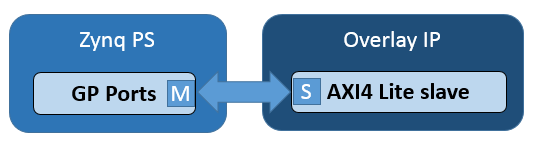

# 07-01\_PYNQ Library详解 - PS与PL接口

## 前言

USB端口和其他的标准接口可以连接现成的USB和其他外部设备到Zynq PS上，并可以通过Python/Linux进行操控。PYNQ图像目前包含了一些最常用的驱动：USB webcams, WIFI接口，以及其他一些标准USB设备。

PYNQ提供overlay的一些底层控制，包括内存映射IO读写，内存分配等。

本章节将按照如下顺序逐一介绍：

* Interrupt
* MMIO
* PS GPIO
* Xlnk

## Interrupt（中断）

Interrupt类代表了Vivado Block Design中的单一中断引脚。它通过使用一个wait函数去阻塞程序直到一个中断被抛出来模仿一个Python事件。这个事件会在中断被清除后自动清理。为了构造一个事件，把全限定（fully qualified）路径传递给Vivado Block Design中的引脚，比如说只传递’my\_ip/interrupt’。

中断只有在一个线程或者协程在等待对应事件的时候才能使用，推荐使用方法为在一个循环里进行等待（wait）操作，检查并清除IP里的中断注册器，然后再结束等待。比如说，AxiGPIO类就用这个方法等待所需要的值。

```javascript
class AxiGPIO(DefaultIP):
    # Rest of class definition

    def wait_for_level(self, value):
        while self.read() != value:
            self._interrupt.wait()
            # Clear interrupt
            self._mmio.write(IP_ISR, 0x1)
```

## MMIO

MMIO类允许Python对象获取映射的系统内存地址。特别的，在PL里的外部设备的注册与地址空间都是可以访问的。

在一个overlay里，连接到AXI通用端口的外设将会把他们的注册器或地址空间映射到系统内存里。通过PYNQ，一个IP的注册器或者地址空间就可以通过MMIO类从Python获取。



MMIO提供了一个简单但方便的方法来访问控制外设。对于只有少量数据交互或者性能要求不高的外设，MMIO通常都是够用了的。如果对性能要求很高，或者大量数据要在PS和PL间传输，那么使用带有DMA IP和PYNQ DMA类的Zynq HP接口会更合适。

**实例：**

在这个例子里，数据会被写到一个IP并从相同的地址读取。

```javascript
IP_BASE_ADDRESS = 0x40000000
ADDRESS_RANGE = 0x1000
ADDRESS_OFFSET = 0x10

from pynq import MMIO
mmio = MMIO(IP_BASE_ADDRESS, ADDRESS_RANGE)

data = 0xdeadbeef
mmio.write(ADDRESS_OFFSET, data)
result = mmio.read(ADDRESS_OFFSET)
```

这个例子假设内存映射区域是从0x40000000到0x40001000，且对PS来说是可访问的。更多的信息可以在pynq.mmio模块找到。

## PS GPIO

Zynq设备有最多从PS到PL的64个GPIO。它们可以用来做简单的操控。比如base overlay中通过PS GPIO来对IOP进行复位/重置。PS GPIO是一个非常简单的接口，并不需要PL中的IP就可以使用。

GPIO类就是用来控制PS GPIO的。\(注意: AXI GPIO是由AxiGPIO类控制的\)


 PS GPIO使用Linux核来控制GPIO。这意味着操作系统会在运行时给GPIO分配一个标号。在使用PS GPIO之前，我们必须把Linux引脚标号映射到Python GPIO实例上。

Get\_gpio\_pin\(\)函数就是用来映射PS引脚标号到Linux引脚标号上的。

```javascript
from pynq import GPIO

output = GPIO(GPIO.get_gpio_pin(0), 'out')
input = GPIO(GPIO.get_gpio_pin(1), 'in')

output.write(0)
input.read()
```

更多内容可以在pynq.gpio模块找到。

## Xlnk

Xlnk类用来分配连续内存。

连接到AXI Master（HP或ACP端口）的IP能访问PS DRAM。在PL里的IP访问DRAM前，必须给IP分配内存。Python里的一个数组将会被分配到虚拟内存的某个地方。被分配的物理内存地址必须提供给PL里的IP。

Xlnk可以分配内存，并提供物理指针。它可以分配连续地址，PL IP可以用的更有效。通过Numpy包，Xlnk可以分配数组，这允许专门制定数组的数据类型。Xlnk也被DMA隐式使用来分配内存。

**实例：**

我们创建一个Xlnk实例，并用cma\_array\(\)来分配unsigned 32-bit int的连续区块内存：

```javascript
from pynq import Xlnk
import numpy as np

xlnk = Xlnk()
input_buffer = xlnk.cma_array(shape=(5,), dtype=np.uint32)
```

physical\_address 是memory buffer的属性：

```javascript
input_buffer.physical_address
```

写数据到buffer：

```javascript
for i in range(5):
    input_buffer[i] = i

# Input buffer:  [0 1 2 3 4]
```

更多数据可在pynq.xlnk找到。

