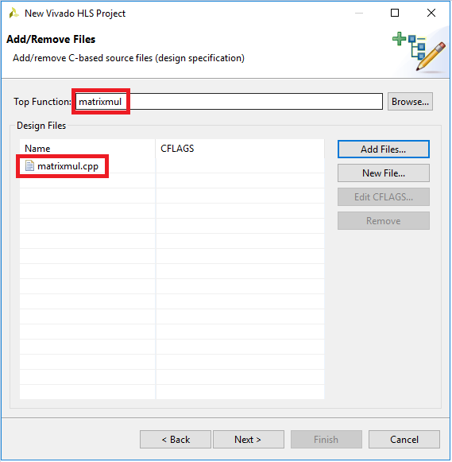
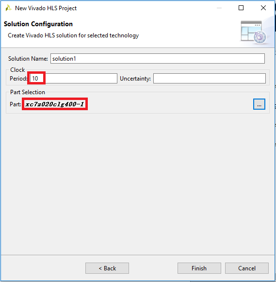
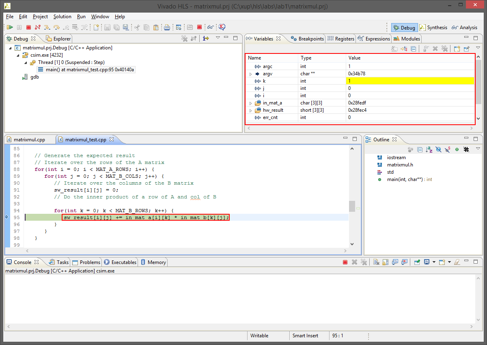
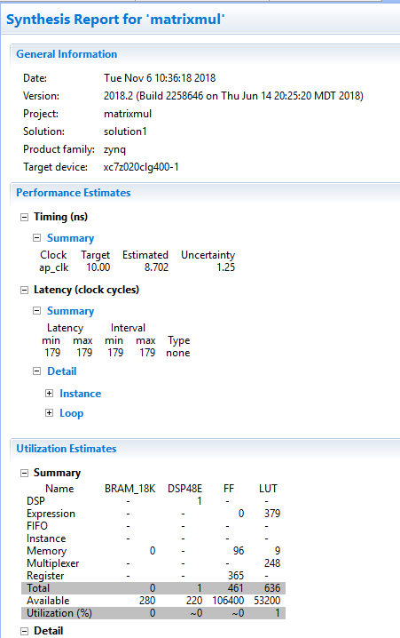
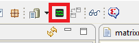

# 11-1\_基于HLS的加速器Overlay设计实例 - 快速生成硬件IP

## 介绍

本章节介绍了HLS的基本操作流程，你将熟悉HLS工程的创建、仿真、综合与实现流程。

## 目标

* ​       使用Vivado HLS工具创建工程
* ​       对设计进行仿真
* ​        对设计进行综合
* ​        对设计进行实现
* ​        使用Vivado HLS分析工具对工程进行分析

## 步骤1:创建新的工程

### 1.     创建一个适用于PYNQ-Z2的HLS工程

**1.1** 将lab1\_src目录下的3个源文件拷贝到**C:\xup\hls\_labs\lab1**目录下；

**1.2** 启动 Vivado HLS工具: **Start &gt; Xilinx Design Tools &gt; Vivado HLS 2018.2；**

**1.3** 点击 **Create New Project**创建新的HLS工程；

**1.4** 点击**Browse…**选择工程目录到为 **：C:\xup\hls\_labs\lab1** ,项目名称填写为：**matrixmul** ，点击**Next**；

**注：**工程目录与工程名称可自己定义

**1.5** 点击 **Add Files…** 按钮，添加**C:\xup\hls\_labs\lab1**目录下的matrixmul.cpp 文件到工程中，**Top Function**栏内填写**matrixmul**；

**注：**matrixmul为源文件matrixmul.cpp内的函数名，本lab将会把该函数综合为可在Vivado中调用的硬件IP。

**1.6** 点击 **Next** 按钮；

**1.7** 点击**Add Files…** 按钮, 添加**C:\xup\hls\_labs\lab1** 目录下的 **matrixmul\_test.cpp** 到工程中；

**1.8** 选中 matrixmul\_test.cpp文件，然后点击 **Edit CFLAG…** 按钮, 输入 **-DHW\_COSIM**, 点击**OK**；

**注：**该flag会在后续的流程中使用到

**1.9** 点击 **Next**；

**1.10** 时钟周期设置为10ns，器件选择为**xc7z020clg400-1**

**1.11** 点击 **Finish**按钮，完成工程创建；

**1.12** 双击 **matrixmul.cpp**文件查看源代码内容；

## 步骤 2:运行 C 代码仿真 （可跳过该步骤）

​

### 2.运行C代码仿真，检查C代码是否正确

**2.1** 点击 **Project &gt; Run C Simulation** 或者直接点击工具栏的 按钮, 然后点击 **OK** 开始C代码仿真；

_可以在_ _Console_ _窗口观察源代码编译过程与测试结果_

**2.2** 双击 **matrixmul\_test.cpp** **文件可以观察测试代码**

**注：**因为我们在之前的步骤中对**HW\_COSIM**进行了定义，所以**matrixmul\_test** 的主函数会调用matrixmul 函数，对matrixmul函数的输出结果与软件计算结果进行比较并打印出来。

如果没有对**HW\_COSIM**进行定义，则只会打印出计算结果，不会判断自定义函数是否正确。

## 步骤 3:C代码调试（可跳过该步骤）

### 3. 让代码在调试模式下运行

**3.1** 点击 **Project &gt; Run C Simulation** 或者直接点击工具栏的  按钮, 在弹出的窗口中勾选**Launch Debugger**，然后点击 **OK**；

**注：**代码在编译过程中会增加-g选项，使得可执行代码中包含调试信息。

**3.2** Debug窗口将被自动打开，程序停留在main\(\) 函数入口；

**3.3** 在代码的第105行，输出“{“ 的位置，双击鼠标，在该位置添加断点；

**3.4** 在101行，调用matrixmul\(\) 函数的位置处添加一个断点；

**3.5** 点击 **Step Over \(F6\)** 按钮 \(  \), 观察代码执行过程中变量的变化；

**3.6** 点击 **Resume** \(  \) 按钮或者按**F8\*\***，\*\*代码将执行到 第101行；

可以观察到软件计算的结果，如下图所示；

**3.7** 点击 工具栏**Step Into \(F5\)** 按钮\( \) 会跳转到 **matrixmul** 函数；

**3.8** 点击 工具栏**Step Over \(F6\)** **几次，观察运算过程，**然后点击工具栏 **Step Return \(F7\)** 按钮可以返回到调用它的测试代码主程序内；

**3.9** 代码将停留在 105 行的断点处. 观察软件计算与硬件计算结果。

**3.10** 在第134行设置断点 \(**return err\_cnt;**位置\)，点击**Resume** 按钮；

在Console窗口打印仿真结果。

**3.11** 点击工具栏 **Resume**按钮或者**Terminate**按钮结束调试会话。

## 步骤4：设计综合

#### 4.切换到综合 \(Synthesis\) 界面，观察综合过程。

**4.1** 点击右上角的  ，切换到综合（Synthesis）界面；

**4.2** 点击 **Solution &gt; Run C Synthesis &gt; Active Solution** 或者工具栏的  按钮开始综合；

**4.3** 综合完成后会显示综合报告，报告中包含了性能与资源预估，以及设计的延时信息；

**4.4** 综合后生成的文件如下所示；

**4.5** 报告中还包含了顶层接口信号

​

## 步骤5：  运行C/RTL 协同仿真，会调用Verilog/VHDL仿真工具进行仿真。

**5.1** 点击 **Solution &gt; Run C/RTL Cosimulation\*\***，打开软件协同仿真工具；\*\*

**5.2** 设置仿真工具为**Vivado Simulator**，语言为**Verilog**，Dunp Trace选择为**all**；

**5.3** 仿真报告如下所示；

**5.4**  点击工具栏的**Open Wave Viewer…**查看硬件仿真波形；

## 步骤6：导出 RTL代码与实现结果

### 在 Vivado HLS, 选择Verilog，导出硬件设计, and run the implementation by selecting Evaluate option.

**6.1** 选择 **Solution &gt; Export RTL** 或者点击工具栏  按钮；

**6.2** 选中 _Vivado synthesis, place and route_ 复选框来运行实现（implementation） 工具

**6.3** 点击 **OK** ，设计实现将开始运行，完成后的设计实现报告如下；

**6.4** 生成的IP被以zip file格式存放到了impl\ip目录下.

  
**6.5** 点击**File &gt; Exit**，关闭HLS工具

