# 11-2\_基于HLS的加速器Overlay设计实例 - Notebook中调用硬件IP

## 介绍

本章节介绍了IP的接口及for循环语句directive基本方法、在Vivado工程中实例化HLS IP的流程、以及在Jupyter Notebook上对IP的调用方法。

## 目标

* ​      使用基本的HLS directive
* ​     在Vivado中实例化HLS IP
* ​      Jupyter notebook中调用HLS IP

## 步骤1：创建新的Solution

### 打开实验1中的HLS工程，创建新的Solution

**1.1** 打开实验1中的HLS工程，点击 **Project &gt; New Solution…**；

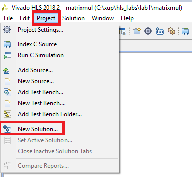

**1.2** 默认设置，点击 **Finish**按钮；

**1.3** 默认设置，点击 **Finish**按钮，工程中将会增加一个Solution2；

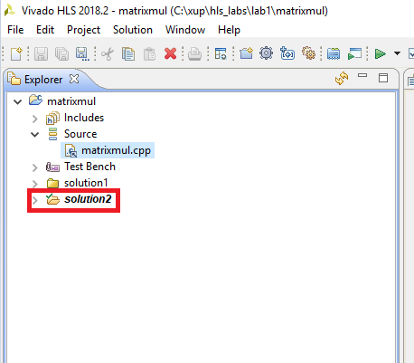

**1.4** 双击**matrixmul.cpp**，在**Directive**窗口，点击**matrixmul**后右键，将会出现对函数顶层模块插入Directive的选项；

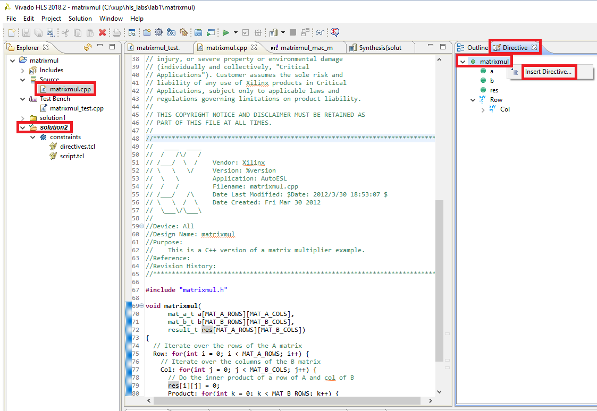

**1.5** 点击Directive后，参照如下配置，点击**OK**；

**1.6** 使用同样的方法，对参数a、b、res和test添加directive，参照如下配置；

**1.7** 单击**Col**后，右键选择**Insert Dorective…**；

**1.8** 参照如下配置，点击OK；

**1.9** 最终的配置结果如下所示；

**1.10** 所有的directives都保存在了directives.tcl文件中；

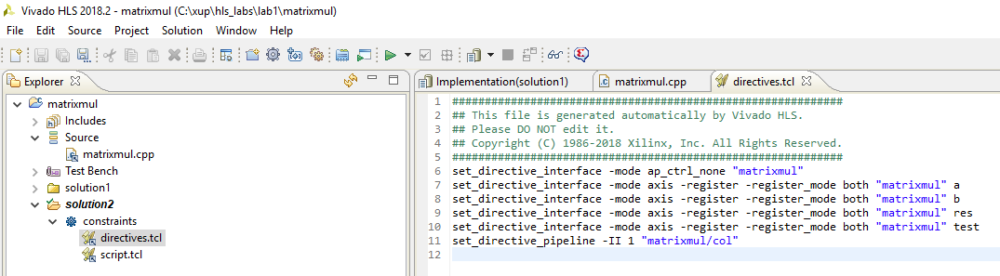

**1.11** 点击 Solution &gt; Run C Synthesis &gt; Active Solution，对solution2进行综合；

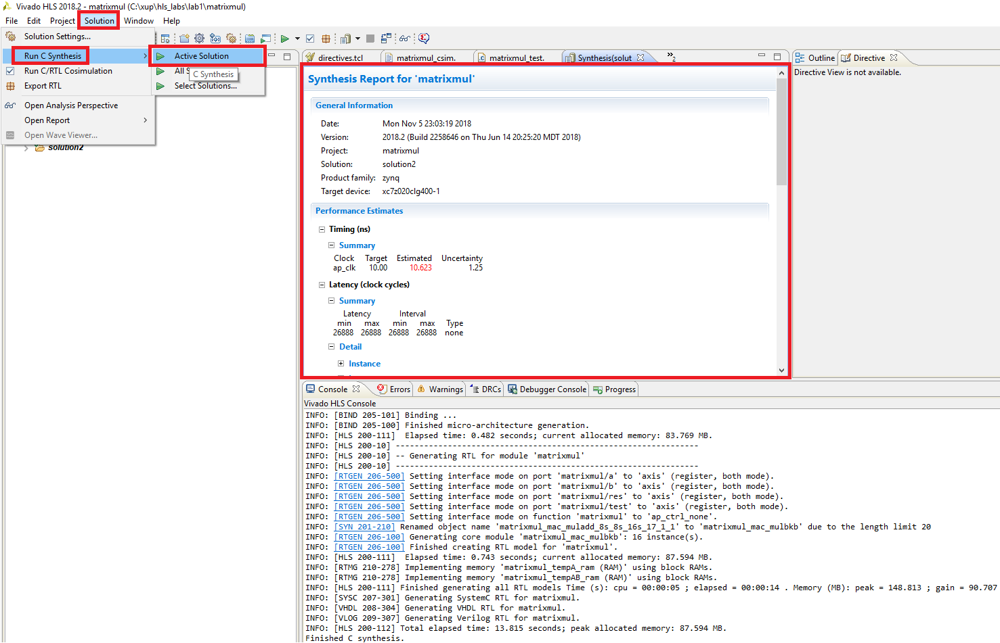

**1.12** 点击工具栏 Export RTL按钮，导出IP；

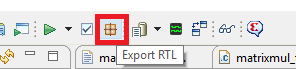

**1.13** 弹出对话框作如下配置，点击OK；

**1.14** Export报告如下；

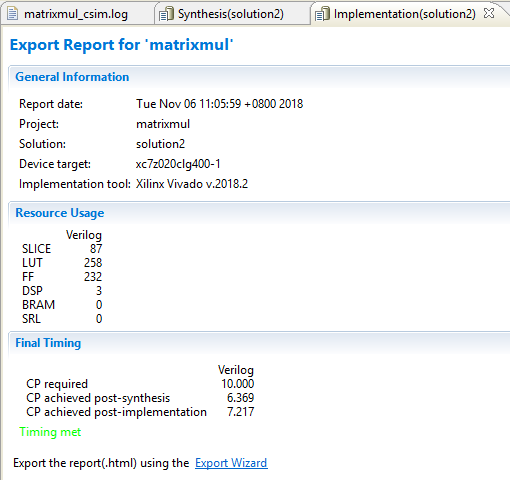

**1.15** 关闭HLS；

## 步骤2：创建Vivado工程

### 2.创建Vivado工程:例化HLS IP到工程中

**2.1** 启动 Vivado工具: Start &gt; Xilinx Design Tools &gt; Vivado 2018.2；

**2.2** 新建Vivado工程；

**2.3** 一直点击**Next**按钮；

**2.4** 选择PYNQ-Z2板；

**2.5** 将刚刚生成的zip包拷贝到Vivado工程的.ip.user\_files后解压缩；

**2.6** 将.ip.user\_files文件夹添加到ip库；

**2.7** 创建 Block Design；

**2.8** 添加ZYNQ7 Processing System IP 到Block Design；

**2.9** 点击Run Block Automation，保持默认配置，点击OK；

**2.10** 为Zynq Processing System增加HP0口；

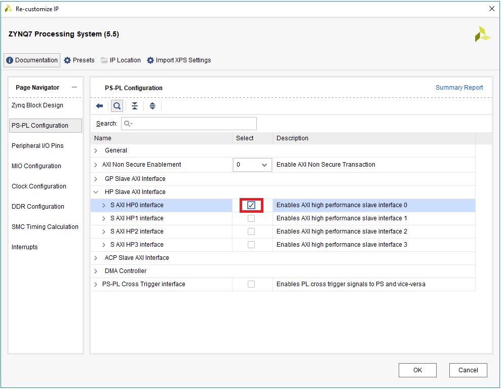

**2.11** 例化Matrixmul到Block Design；

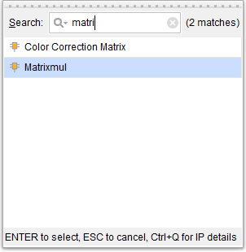

**2.12** 通过AXI DMA将Matrixmul IP连接到PS侧，最终的Block Design如下图所示；

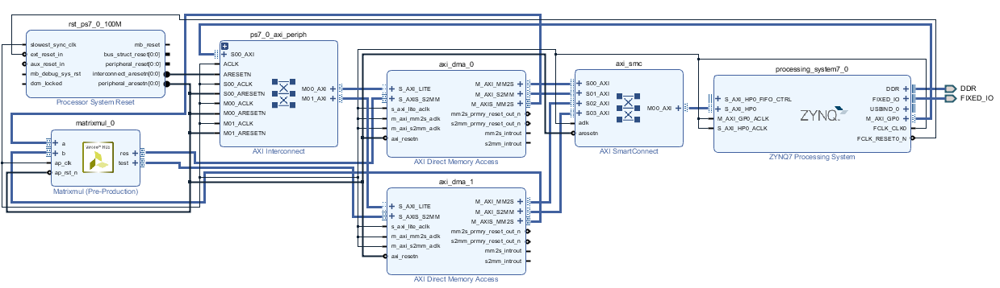

**2.13** 创建 HDL Wrapper文件；

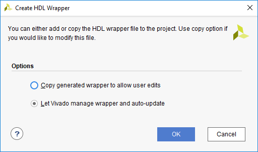

**2.14** 生成Bitstream文件；

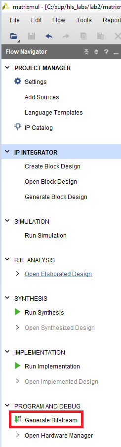

**2.15** 生成Block Design的tcl文件；

**2.16** 将tcl文件和bitstream文件拷贝到lab2\_src/matrixmul目录，并将tcl文件和bitstream文件重命名为matrixmul.tcl和matrixmulbit；

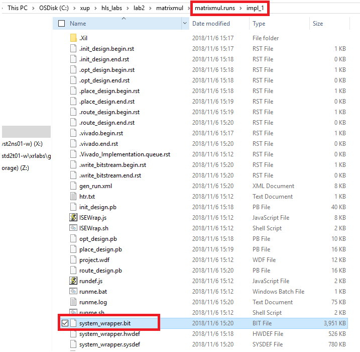

## 步骤3：连接PYNQ-Z2测试

### 3. 将PYNQ-Z2上电，通过Jupyter访问Matrixmul IP

**3.1** 将笔记本或者PC机的IP地址设置为192.168.2.X

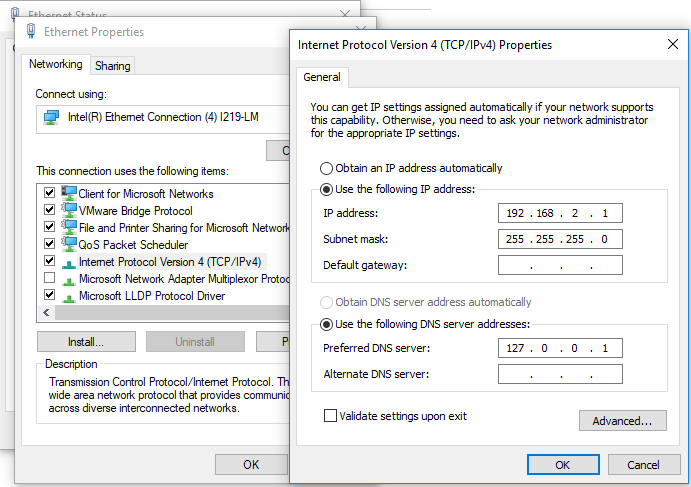

**3.2**  按如下方式设置好PYNQ-Z2，并将PYNQ-Z2通过网线连接到PC后，然后上电；

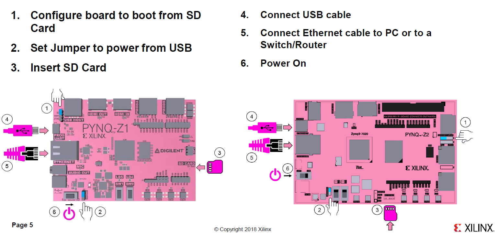

**3.3** 待PYNQ-Z2启动完成后，通过Winscp等sftp工具将包含tcl文件、bitstream文件和ipynb文件的matrixmul文件夹下载到板卡的jupyter\_notebooks目录中；

**注**:用户名与密码均为: **xilinx**

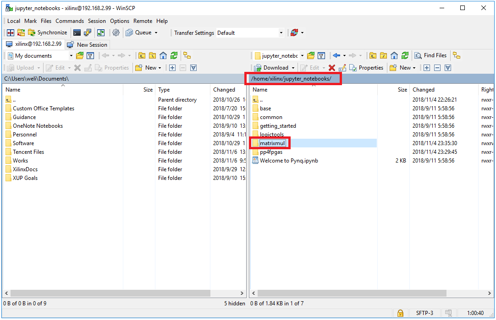

**3.4** 打开Chrome或者Firefox等IE浏览器，输入192.168.2.99，密码为：xilinx

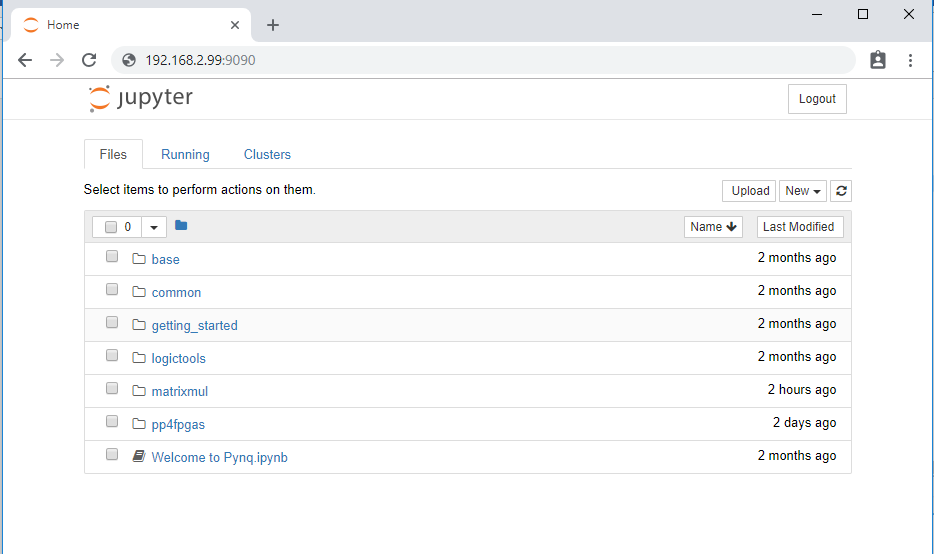

**3.5**  打开matrixmul目录，运行matrixmul.ipynb开始测试，

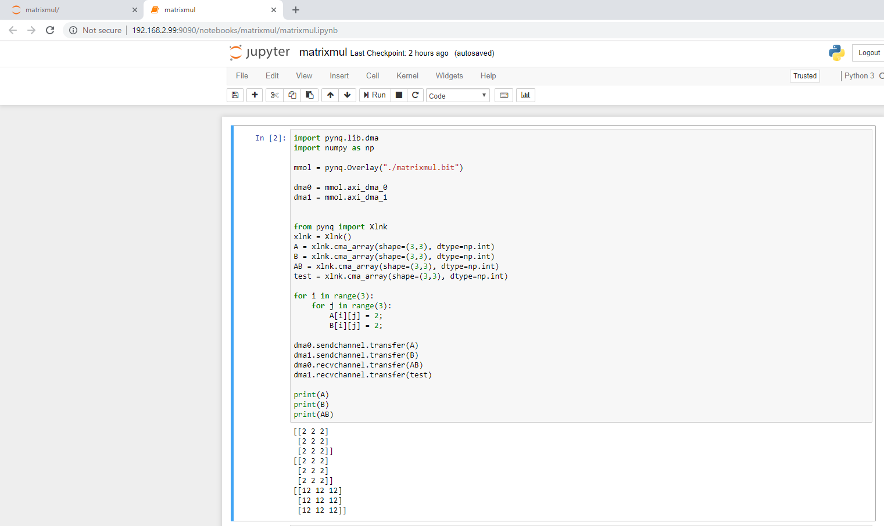

